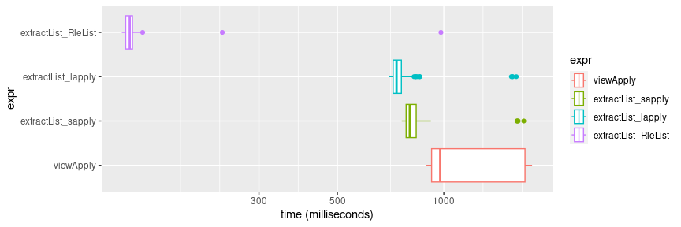

## Purpose

The function to compute cumulative sums is one of the slowest in CAGEr.
Can we speed it up?

## Setup


```r
library("CAGEr")   |> suppressPackageStartupMessages()
library("ggplot2") |> suppressPackageStartupMessages()
```

### Example data


```r
(clusters <- tagClustersGR(exampleCAGEexp)[[1]])
```

```
## TagClusters object with 532 ranges and 6 metadata columns:
##       seqnames            ranges strand |            score   nr_ctss
##          <Rle>         <IRanges>  <Rle> |            <Rle> <integer>
##     1    chr17          26050540      + |  22.310089406231         1
##     2    chr17          26391265      + |  22.310089406231         1
##     3    chr17          26446219      + |  22.310089406231         1
##     4    chr17          26453605      + | 44.5738050899834         1
##     5    chr17 26453632-26453708      + | 1023.81202126363        16
##   ...      ...               ...    ... .              ...       ...
##   528    chr17          32706269      + |  22.310089406231         1
##   529    chr17          32706379      + | 66.8200508203776         1
##   530    chr17 32707348-32707353      + | 89.1939839024454         3
##   531    chr17          32708868      + |  22.310089406231         1
##   532    chr17          32708942      + |  22.310089406231         1
##       dominant_ctss tpm.dominant_ctss q_0.1 q_0.9
##           <integer>             <Rle> <Rle> <Rle>
##     1      26050540   22.310089406231     1     1
##     2      26391265   22.310089406231     1     1
##     3      26446219   22.310089406231     1     1
##     4      26453605  44.5738050899834     1     1
##     5      26453667  288.917306039892    30    72
##   ...           ...               ...   ...   ...
##   528      32706269   22.310089406231     1     1
##   529      32706379  66.8200508203776     1     1
##   530      32707353  44.5738050899834     1     6
##   531      32708868   22.310089406231     1     1
##   532      32708942   22.310089406231     1     1
##   -------
##   seqinfo: 26 sequences (1 circular) from danRer7 genome
```

```r
(ctss <- CTSSnormalizedTpmGR(exampleCAGEexp, 1))
```

```
## CTSS object with 1697 positions and 6 metadata columns:
##          seqnames       pos strand |           genes annotation exprClass
##             <Rle> <integer>  <Rle> |           <Rle>      <Rle>     <Rle>
##      [1]    chr17  26050540      + |          grid1a   promoter       4_4
##      [2]    chr17  26391265      + | si:ch73-34j14.2       exon       0_0
##      [3]    chr17  26446219      + |                    unknown       4_4
##      [4]    chr17  26453605      + |                   promoter       4_3
##      [5]    chr17  26453632      + |                   promoter       2_1
##      ...      ...       ...    ... .             ...        ...       ...
##   [1693]    chr17  32707348      + |          ywhaqb     intron       4_4
##   [1694]    chr17  32707350      + |          ywhaqb     intron       4_4
##   [1695]    chr17  32707353      + |          ywhaqb     intron       4_4
##   [1696]    chr17  32708868      + |          ywhaqb       exon       0_2
##   [1697]    chr17  32708942      + |          ywhaqb       exon       4_4
##          filteredCTSSidx                cluster            score
##                    <Rle>                  <Rle>            <Rle>
##      [1]            TRUE       chr17:26050540:+  22.310089406231
##      [2]            TRUE chr17:26391265-26391..  22.310089406231
##      [3]            TRUE       chr17:26446219:+  22.310089406231
##      [4]            TRUE chr17:26453603-26453.. 44.5738050899834
##      [5]            TRUE chr17:26453603-26453.. 44.5738050899834
##      ...             ...                    ...              ...
##   [1693]            TRUE chr17:32707322-32707..  22.310089406231
##   [1694]            TRUE chr17:32707322-32707..  22.310089406231
##   [1695]            TRUE chr17:32707322-32707.. 44.5738050899834
##   [1696]            TRUE chr17:32708847-32708..  22.310089406231
##   [1697]            TRUE chr17:32708847-32708..  22.310089406231
##   -------
##   seqinfo: 26 sequences (1 circular) from danRer7 genome
##   BSgenome name: BSgenome.Drerio.UCSC.danRer7
```

## Current implementation at the time the benchmark was written.


```r
cumsums_viewApply <- function(ctss, clusters) {
  cov <- Rle(rep(0, max(end(clusters), end(ctss))))
  cov[start(ctss)] <- score(ctss)
  cluster.cumsums <- Views(cov, start = start(clusters), end = end(clusters))
  viewApply(cluster.cumsums, cumsum)
}
cumsums_viewApply_res <- cumsums_viewApply(ctss, clusters)
head(cumsums_viewApply_res)
```

```
## [[1]]
## numeric-Rle of length 1 with 1 run
##   Lengths:       1
##   Values : 22.3101
## 
## [[2]]
## numeric-Rle of length 1 with 1 run
##   Lengths:       1
##   Values : 22.3101
## 
## [[3]]
## numeric-Rle of length 1 with 1 run
##   Lengths:       1
##   Values : 22.3101
## 
## [[4]]
## numeric-Rle of length 1 with 1 run
##   Lengths:       1
##   Values : 44.5738
## 
## [[5]]
## numeric-Rle of length 77 with 16 runs
##   Lengths:        11         4        14 ...         2         5         1
##   Values :   44.5738   66.8839   89.1940 ...  912.4182  979.2382 1023.8120
## 
## [[6]]
## numeric-Rle of length 1 with 1 run
##   Lengths:       1
##   Values : 22.3101
```

## Alternative functions.

`cumsums_extractList_sapply` is a reduced version of the `bioC2_cc_iqw` currently
used in `consensusClustersGR`.


```r
cumsums_extractList_sapply <- function(ctss, clusters) {
  # Fill gaps with zeros
  fill <- GPos(clusters)
  score(fill) <- Rle(0L)
  ctss <- c(ctss, fill[!fill %in% ctss]) |> sort()
  o <- findOverlaps(query = clusters, subject = ctss)
  grouped_scores <- extractList(score(ctss), o)
  sapply(grouped_scores, cumsum)
}
cumsums_extractList_sapply_res <- cumsums_extractList_sapply(ctss, clusters)

cumsums_extractList_aslist <- function(ctss, clusters) {
  # Fill gaps with zeros
  fill <- GPos(clusters)
  score(fill) <- Rle(0L)
  ctss <- c(ctss, fill[!fill %in% ctss]) |> sort()
  o <- findOverlaps(query = clusters, subject = ctss)
  grouped_scores <- extractList(score(ctss), o)
  cumsum(grouped_scores) |> as.list()
}
cumsums_extractList_aslist_res <- cumsums_extractList_aslist(ctss, clusters)

cumsums_extractList_RleList <- function(ctss, clusters) {
  # Fill gaps with zeros
  fill <- GPos(clusters)
  score(fill) <- Rle(0L)
  ctss <- c(ctss, fill[!fill %in% ctss]) |> sort()
  o <- findOverlaps(query = clusters, subject = ctss)
  grouped_scores <- extractList(score(ctss), o)
  cumsum(grouped_scores)
}
cumsums_extractList_RleList_res <- cumsums_extractList_RleList(ctss, clusters)
```

The results are almost the same.  The differences appear to be rounding errors.


```r
# Identical
identical(cumsums_viewApply_res[[3]],  cumsums_extractList_sapply_res[[3]])
```

```
## [1] TRUE
```

```r
cumsums_viewApply_res[[3]] - cumsums_extractList_sapply_res[[3]]
```

```
## numeric-Rle of length 1 with 1 run
##   Lengths: 1
##   Values : 0
```

```r
identical(cumsums_viewApply_res,  cumsums_extractList_sapply_res)
```

```
## [1] TRUE
```

```r
# Slightly different
identical(cumsums_viewApply_res[[3]], cumsums_extractList_RleList_res[[3]])
```

```
## [1] FALSE
```

```r
cumsums_viewApply_res[[3]] - cumsums_extractList_aslist_res[[3]]
```

```
## numeric-Rle of length 1 with 1 run
##   Lengths:           1
##   Values : 3.55271e-15
```

```r
# Identical
identical(cumsums_extractList_RleList_res[[3]], cumsums_extractList_aslist_res[[3]])
```

```
## [1] TRUE
```

## Benchmark


```r
(microbench_out <- microbenchmark::microbenchmark(
  times = 100,
  viewApply = cumsums_viewApply(ctss, clusters),
  extractList_sapply  = cumsums_extractList_sapply(ctss, clusters),
  extractList_lapply  = cumsums_extractList_aslist(ctss, clusters),
  extractList_RleList = cumsums_extractList_RleList(ctss, clusters)
))
```

```
## Unit: milliseconds
##                 expr      min       lq      mean   median        uq       max
##            viewApply 892.9003 923.1840 1170.8610 976.8460 1697.3491 1776.6821
##   extractList_sapply 760.2620 782.2829  843.7974 801.2297  835.7868 1683.2709
##   extractList_lapply 699.5029 718.5011  776.4053 734.9823  758.7260 1603.3350
##  extractList_RleList 122.8387 125.9715  138.9411 129.3399  131.6845  981.3279
##  neval cld
##    100   c
##    100  b 
##    100  b 
##    100 a
```

```r
# https://statisticsglobe.com/microbenchmark-package-r
ggplot(microbench_out, aes(x = time / 1e6, y = expr, color = expr)) +  # Plot performance comparison
  geom_boxplot() + 
  scale_x_log10("time (milliseconds)")
```

<!-- -->

## Result

The winner is about 10 times faster!


```r
sessionInfo()
```

```
## R version 4.2.2 Patched (2022-11-10 r83330)
## Platform: x86_64-pc-linux-gnu (64-bit)
## Running under: Debian GNU/Linux 12 (bookworm)
## 
## Matrix products: default
## BLAS:   /usr/lib/x86_64-linux-gnu/blas/libblas.so.3.11.0
## LAPACK: /usr/lib/x86_64-linux-gnu/lapack/liblapack.so.3.11.0
## 
## locale:
##  [1] LC_CTYPE=en_US.UTF-8       LC_NUMERIC=C              
##  [3] LC_TIME=en_US.UTF-8        LC_COLLATE=en_US.UTF-8    
##  [5] LC_MONETARY=en_US.UTF-8    LC_MESSAGES=en_US.UTF-8   
##  [7] LC_PAPER=en_US.UTF-8       LC_NAME=C                 
##  [9] LC_ADDRESS=C               LC_TELEPHONE=C            
## [11] LC_MEASUREMENT=en_US.UTF-8 LC_IDENTIFICATION=C       
## 
## attached base packages:
## [1] stats4    stats     graphics  grDevices utils     datasets  methods  
## [8] base     
## 
## other attached packages:
##  [1] ggplot2_3.4.2               CAGEr_2.7.1                
##  [3] MultiAssayExperiment_1.24.0 SummarizedExperiment_1.28.0
##  [5] Biobase_2.58.0              GenomicRanges_1.50.0       
##  [7] GenomeInfoDb_1.34.0         IRanges_2.32.0             
##  [9] S4Vectors_0.36.0            BiocGenerics_0.44.0        
## [11] MatrixGenerics_1.10.0       matrixStats_0.62.0         
## 
## loaded via a namespace (and not attached):
##   [1] backports_1.4.1          Hmisc_4.7-1              VGAM_1.1-7              
##   [4] BiocFileCache_2.6.0      plyr_1.8.7               lazyeval_0.2.2          
##   [7] splines_4.2.2            operator.tools_1.6.3     BiocParallel_1.32.0     
##  [10] TH.data_1.1-1            digest_0.6.30            ensembldb_2.22.0        
##  [13] htmltools_0.5.3          fansi_1.0.4              magrittr_2.0.3          
##  [16] checkmate_2.1.0          memoise_2.0.1            BSgenome_1.66.0         
##  [19] cluster_2.1.4            Biostrings_2.66.0        formula.tools_1.7.1     
##  [22] sandwich_3.0-2           prettyunits_1.1.1        jpeg_0.1-9              
##  [25] colorspace_2.1-0         blob_1.2.3               rappdirs_0.3.3          
##  [28] xfun_0.34                dplyr_1.0.10             crayon_1.5.2            
##  [31] RCurl_1.98-1.9           microbenchmark_1.4.9     jsonlite_1.8.4          
##  [34] zoo_1.8-11               survival_3.5-3           VariantAnnotation_1.44.0
##  [37] glue_1.6.2               gtable_0.3.3             zlibbioc_1.44.0         
##  [40] XVector_0.38.0           DelayedArray_0.24.0      scales_1.2.1            
##  [43] mvtnorm_1.1-3            DBI_1.1.3                som_0.3-5.1             
##  [46] Rcpp_1.0.9               progress_1.2.2           htmlTable_2.4.1         
##  [49] foreign_0.8-83           bit_4.0.4                Formula_1.2-4           
##  [52] htmlwidgets_1.5.4        httr_1.4.4               RColorBrewer_1.1-3      
##  [55] ellipsis_0.3.2           farver_2.1.1             pkgconfig_2.0.3         
##  [58] XML_3.99-0.12            Gviz_1.42.0              nnet_7.3-18             
##  [61] sass_0.4.2               dbplyr_2.2.1             deldir_1.0-6            
##  [64] utf8_1.2.3               tidyselect_1.2.0         rlang_1.1.0             
##  [67] reshape2_1.4.4           AnnotationDbi_1.60.0     munsell_0.5.0           
##  [70] tools_4.2.2              cachem_1.0.6             cli_3.6.1               
##  [73] generics_0.1.3           RSQLite_2.2.18           CAGEfightR_1.18.0       
##  [76] evaluate_0.17            stringr_1.4.1            fastmap_1.1.0           
##  [79] yaml_2.3.6               knitr_1.40               bit64_4.0.5             
##  [82] KEGGREST_1.38.0          AnnotationFilter_1.22.0  nlme_3.1-160            
##  [85] xml2_1.3.3               biomaRt_2.54.0           compiler_4.2.2          
##  [88] rstudioapi_0.14          filelock_1.0.2           curl_4.3.3              
##  [91] png_0.1-7                tibble_3.2.1             bslib_0.4.1             
##  [94] stringi_1.7.12           highr_0.9                GenomicFeatures_1.50.1  
##  [97] lattice_0.20-45          ProtGenerics_1.30.0      Matrix_1.5-3            
## [100] vegan_2.6-4              permute_0.9-7            vctrs_0.6.1             
## [103] stringdist_0.9.9         pillar_1.9.0             lifecycle_1.0.3         
## [106] jquerylib_0.1.4          data.table_1.14.4        bitops_1.0-7            
## [109] rtracklayer_1.58.0       R6_2.5.1                 BiocIO_1.8.0            
## [112] latticeExtra_0.6-30      KernSmooth_2.23-20       gridExtra_2.3           
## [115] codetools_0.2-19         dichromat_2.0-0.1        MASS_7.3-58.3           
## [118] gtools_3.9.3             assertthat_0.2.1         rjson_0.2.21            
## [121] withr_2.5.0              GenomicAlignments_1.34.0 Rsamtools_2.14.0        
## [124] multcomp_1.4-20          GenomeInfoDbData_1.2.9   mgcv_1.8-41             
## [127] parallel_4.2.2           hms_1.1.2                grid_4.2.2              
## [130] rpart_4.1.19             rmarkdown_2.17           biovizBase_1.46.0       
## [133] base64enc_0.1-3          interp_1.1-3             restfulr_0.0.15
```
