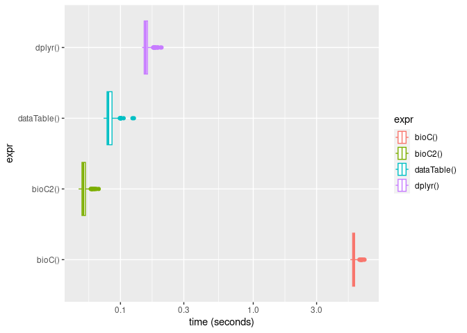

# Purpose

We use `data.table` to find the _dominant CTSS_ in _tag clusters_.  I am
implementing a similar function for _consensus clusters_.  Shall I do it
with Bioconductor core functions, `data.table` or `dplyr`?

# Setup

We have CTSSes and clusters.  The clusters may overlap with each other.


```r
library(CAGEr) |> suppressPackageStartupMessages()
ce <- exampleCAGEexp
ctss <- CTSScoordinatesGR(ce)
score(ctss) <- CTSSnormalizedTpmDF(ce) |> DelayedArray::DelayedArray() |> rowSums()
clusters <- consensusClustersGR(ce)
mcols(clusters) <- mcols(clusters)[,c("score", "dominant_ctss", "tpm.dominant_ctss")] # Simplify
clusters.orig <- clusters
mcols(clusters) <- NULL
```

The functions are given a lookup table associating CTSSes with clusters, and
a function to find the dominant CTSS and break ties by selecting the one
at the center.


```r
o <- findOverlaps(clusters, ctss)

find.dominant.idx <- function (x) {
  # which.max is breaking ties by taking the last, but this will give slightly
  # different biases on plus an minus strands.
  w <- which(x == max(x))
  w[ceiling(length(w)/2)]
}
```

## _Bioconductor_ way


```r
bioC <- function () {
  s <- extractList(score(ctss), o)
  m <- sapply(s, find.dominant.idx)
  grl <- extractList(granges(ctss), o)
  dom <- mapply(`[`, grl, m) |> GRangesList() |> unlist()
  clusters$dominant_ctss <- dom
  clusters$tpm.dominant_ctss <- max(s)
  clusters
}

bioC() -> bioC_results
```

## _Bioconductor_ plus base `R`


```r
bioC2 <- function () {
  rl <- rle(queryHits(o))$length
  cluster_start_idx <- cumsum(c(1, head(rl, -1))) # Where each run starts
  grouped_scores <- extractList(score(ctss), o)
  local_max_idx <- sapply(grouped_scores, find.dominant.idx) -1  # Start at zero
  global_max_ids <- cluster_start_idx + local_max_idx
  clusters$dominant_ctss <- granges(ctss)[subjectHits(o)][global_max_ids]
  clusters$tpm.dominant_ctss <- score(ctss)[subjectHits(o)][global_max_ids]
  clusters
}

bioC2() -> bioC_results2
```

## `data.table` way


```r
library("data.table") |> suppressPackageStartupMessages()
dataTable <- function() {
  dt <- ctss |> as.data.frame() |> data.table::as.data.table()
  dt$id <- dt$cluster |> as.factor() |> as.integer()
  dom <- dt[ , list( seqnames[1]
                   , strand[1]
                   , pos[find.dominant.idx(score)]
                   , max(score))
            , by = id]
  setnames(dom, c( "cluster", "chr", "strand"
                 , "dominant_ctss", "tpm.dominant_ctss"))
  
  clusters$dominant_ctss <- GRanges(dom$chr, dom$dominant_ctss, dom$strand)
  seqinfo(clusters$dominant_ctss) <- seqinfo(ctss)
  clusters$tpm.dominant_ctss <- dom$tpm.dominant_ctss
  clusters  
}

dataTable() -> dataTable_results
```

## `dplyr` way


```r
dplyr <- function() {
  tb <- ctss |> as.data.frame() |> tibble::as_tibble()
  tb$id <- tb$cluster |> as.factor() |> as.integer()
  dom <- tb |> dplyr::group_by(id) |>
      dplyr::summarise(seqnames = unique(seqnames), strand = unique(strand),
                       tpm.dominant_ctss = max(score), dominant_ctss = pos[find.dominant.idx(score)])
  clusters$dominant_ctss <- GRanges(dom$seqnames, dom$dominant_ctss, dom$strand)
  seqinfo(clusters$dominant_ctss) <- seqinfo(ctss)
  clusters$tpm.dominant_ctss <- dom$tpm.dominant_ctss
  clusters
}

dplyr() -> dplyr_results
```

# Checks and benchmark


```r
bioC_results
```

```
## ConsensusClusters object with 806 ranges and 2 metadata columns:
##                             seqnames            ranges strand |
##                                <Rle>         <IRanges>  <Rle> |
##            chr17:26027430:+    chr17          26027430      + |
##            chr17:26050540:+    chr17          26050540      + |
##            chr17:26118088:+    chr17          26118088      + |
##            chr17:26142853:+    chr17          26142853      + |
##            chr17:26166954:+    chr17          26166954      + |
##                         ...      ...               ...    ... .
##   chr17:32706021-32706407:+    chr17 32706021-32706407      + |
##            chr17:32706605:+    chr17          32706605      + |
##   chr17:32707132-32707170:+    chr17 32707132-32707170      + |
##   chr17:32707322-32707376:+    chr17 32707322-32707376      + |
##   chr17:32708847-32708958:+    chr17 32708847-32708958      + |
##                                dominant_ctss tpm.dominant_ctss
##                                    <GRanges>         <numeric>
##            chr17:26027430:+ chr17:26027430:+           64.1719
##            chr17:26050540:+ chr17:26050540:+           22.3101
##            chr17:26118088:+ chr17:26118088:+           64.1719
##            chr17:26142853:+ chr17:26142853:+           56.0704
##            chr17:26166954:+ chr17:26166954:+           64.1719
##                         ...              ...               ...
##   chr17:32706021-32706407:+ chr17:32706231:+        14993.7493
##            chr17:32706605:+ chr17:32706605:+           64.1719
##   chr17:32707132-32707170:+ chr17:32707135:+           99.6448
##   chr17:32707322-32707376:+ chr17:32707322:+           67.2963
##   chr17:32708847-32708958:+ chr17:32708890:+         1319.9060
##   -------
##   seqinfo: 26 sequences (1 circular) from danRer7 genome
```

```r
identical(bioC_results, bioC_results2)
```

```
## [1] TRUE
```

```r
identical(bioC_results, dataTable_results)
```

```
## [1] TRUE
```

```r
identical(bioC_results, dplyr_results)
```

```
## [1] TRUE
```

```r
(benchmark <- microbenchmark::microbenchmark(bioC(), bioC2(), dataTable(), dplyr()))
```

```
## Unit: milliseconds
##         expr        min         lq       mean     median         uq        max
##       bioC() 5383.80738 5604.18083 5810.65343 5682.86584 5800.26130 6887.00923
##      bioC2()   48.39151   51.30989   53.76299   52.46706   54.49261   68.59898
##  dataTable()   74.60784   79.24606   84.51815   80.90140   86.89849  126.27618
##      dplyr()  145.54982  150.83453  159.48283  154.80674  159.93879  203.85146
##  neval
##    100
##    100
##    100
##    100
```

```r
library("ggplot2") |> suppressPackageStartupMessages()
ggplot(benchmark, aes(x = time / 1e9, y = expr, color = expr)) +  # Plot performance comparison
  geom_boxplot() + 
  scale_x_log10("time (seconds)")
```

<!-- -->

The approach combining `findOverlaps` from _Bionductor_ and cumulative sums from
base _R_ works the best on test data, with comparable performance with `dplyr`
and `data.table`.  This opens the way to the removal of the dependency to
`data.table`.  In the future, if we start to import `dplyr` for reasons related
to `ggplot2` or `plyranges`, we may might replace the _Bioc + base R_ version
with a `dplyr` one, that is probably easier to read for most contributors. 
