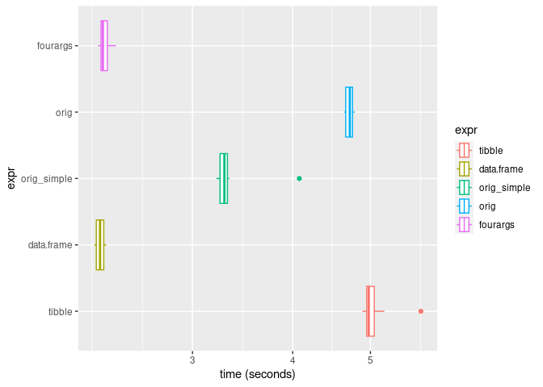

## Purpose

While refactoring the Paraclu code, I wondered if some data structures would be
more efficient than `data.frame`s.

## Example data

Let's focus on the clustering of positions with scores from one strand of one
chromosome, because this is where the algorithm is recursive and hard to
parallelise.

In the original implementation the input in two columns of a `data.frame`.  Here
I also try a `Pairs` object, or just two separate arguments for the positions
and scores.


```r
ctss <- CTSSnormalizedTpmGR(exampleCAGEexp,1)
isSorted(ctss)
```

```
## [1] TRUE
```

```r
ctss.df <- as.data.frame(granges(ctss))
ctss.df$tpm <- decode(score(ctss))
ctss.df$pos <- ctss.df$start
ctss.df$end <- ctss.df$start <- ctss.df$width <- NULL

pair <- Pairs(pos(ctss), decode(score(ctss)))
DF <- DataFrame(pos = pos(ctss), score = decode(score(ctss)))
l <- list(pos = pos(ctss), score = decode(score(ctss)))
```

## The paraclu parameters function

The main recursive functions call a subfunction that compute the density and
the next break point.  First, let's see if it can be optimised.

`paraclu_params_df` was originally called `.paraclu1`.  The other functions
are rewrites.


```r
paraclu_params_df <- function(ctss) {
	sit <- nrow(ctss)
	tot <- sum(ctss$tpm)
	if(sit == 1) {
		min_density <- Inf
		br <- NA
	}else{
		densities_forward <- cumsum(ctss$tpm)[-sit]/(ctss$pos[2:sit] - ctss$pos[1])
		densities_reverse <- cumsum(rev(ctss$tpm))[-sit]/(ctss$pos[sit] - ctss$pos[(sit-1):1])
		min_densities = c(min(densities_forward), min(densities_reverse))
		breaks <- c(which(densities_forward == min_densities[1])[1] + 1, sit + 1 - which(densities_reverse == min_densities[2])[1])
		min_density <- min(min_densities)
		br <- breaks[tail(which(min_densities == min_density),1)]
	}
	list(br = br, min_density = min_density, tot = tot, sit = sit)
}
paraclu_params_df(ctss.df)
```

```
## $br
## [1] 2
## 
## $min_density
## [1] 6.547829e-05
## 
## $tot
## [1] 220525.6
## 
## $sit
## [1] 1697
```

```r
paraclu_params_Pairs <- function(pair) {
  sit   <- length(pair)
  score <- second(pair)
  tot   <- sum(score)
  if(sit == 1) return(list(br = NA, min_density = Inf, tot = tot, sit = sit))
  pos   <- first(pair)
  densities_forward <- cumsum(    score) [-sit] / (pos[2:sit] - pos[1]        )
  densities_reverse <- cumsum(rev(score))[-sit] / (pos[sit]   - pos[(sit-1):1])
  min_densities = c(min(densities_forward), min(densities_reverse))
  breaks <- c(     1 +   which(densities_forward == min_densities[1])[1]
             , sit + 1 - which(densities_reverse == min_densities[2])[1])
  min_density <- min(min_densities)
  br <- breaks[tail(which(min_densities == min_density),1)]
  list(br = br, min_density = min_density, tot = tot, sit = sit)
}
identical(paraclu_params_Pairs(pair), paraclu_params_df(ctss.df))
```

```
## [1] TRUE
```

```r
paraclu_params_DF <- function(DF) {
  sit   <- nrow(DF)
  tot   <- sum(DF$score)
  if(sit == 1) return(list(br = NA, min_density = Inf, tot = tot, sit = sit))
  densities_forward <- cumsum(    DF$score) [-sit] / (DF$pos[2:sit] - DF$pos[1]        )
  densities_reverse <- cumsum(rev(DF$score))[-sit] / (DF$pos[sit]   - DF$pos[(sit-1):1])
  min_densities = c(min(densities_forward), min(densities_reverse))
  breaks <- c(     1 +   which(densities_forward == min_densities[1])[1]
             , sit + 1 - which(densities_reverse == min_densities[2])[1])
  min_density <- min(min_densities)
  br <- breaks[tail(which(min_densities == min_density),1)]
  list(br = br, min_density = min_density, tot = tot, sit = sit)
}
identical(paraclu_params_DF(DF), paraclu_params_df(ctss.df))
```

```
## [1] TRUE
```

```r
paraclu_params_twoargs <- function(pos, score) {
  sit   <- length(pos)
  tot   <- sum(score)
  if(sit == 1) return(list(br = NA, min_density = Inf, tot = tot, sit = sit))
  densities_forward <- cumsum(    score) [-sit] / (pos[2:sit] - pos[1]        )
  densities_reverse <- cumsum(rev(score))[-sit] / (pos[sit]   - pos[(sit-1):1])
  min_densities = c(min(densities_forward), min(densities_reverse))
  breaks <- c(     1 +   which(densities_forward == min_densities[1])[1]
             , sit + 1 - which(densities_reverse == min_densities[2])[1])
  min_density <- min(min_densities)
  br <- breaks[tail(which(min_densities == min_density),1)]
  list(br = br, min_density = min_density, tot = tot, sit = sit)
}
identical(paraclu_params_twoargs(l$pos, l$score), paraclu_params_df(ctss.df))
```

```
## [1] TRUE
```

```r
microbenchmark::microbenchmark(
  data.frame = paraclu_params_df(ctss.df),
  Pairs      = paraclu_params_Pairs(pair),
  DataFrame  = paraclu_params_DF(DF),
  two_args   = paraclu_params_twoargs(l$pos, l$score),
  times = 1000)
```

```
## Unit: microseconds
##        expr      min        lq      mean    median        uq       max neval
##  data.frame   88.760  106.4695  151.6922  117.5020  149.7100  6851.252  1000
##       Pairs  190.730  223.2810  313.0306  248.9615  310.5180  9349.667  1000
##   DataFrame 3952.067 4382.7235 4808.1692 4657.3280 5071.8605 12485.169  1000
##    two_args   79.675   90.0480  130.7938   99.4555  123.4375  7440.558  1000
##  cld
##  a  
##   b 
##    c
##  a
```

All functions are microsecond-fast except the DF one.  Let's use the two-
arguments version in all the benchmarks below.

## Recursive Paraclu function

The original recursive function was originally called `.paraclu2`.  It computes
extra information like dominant peak etc, which is nice but [we have a good
function to do that _a posteriori_](.dominant_ctss.md).  Therefore we will compare
implementations that skip that calculation.


```r
# Originally called .paraclu2
# Minor changes applied to keep ctss.df colnames.
# Removed re-sorting of output
paraclu_orig <- function(ctss, min_density = -Inf, clusters.df = data.frame()) {
	if(nrow(ctss)>0){
		params <- paraclu_params_twoargs(ctss$pos, ctss$tpm)
		br <- params[[1]]
		max_density <- params[[2]]
		tot <- params[[3]]
		sit <- params[[4]]
		
		if(!(max_density == Inf)){
			new_min <- max(min_density, max_density)
			clusters.df <- rbind(paraclu_orig(ctss = ctss[1:(br-1),], min_density = new_min, clusters.df = clusters.df), 
			                     paraclu_orig(ctss = ctss[br:nrow(ctss),], min_density = new_min, clusters.df = clusters.df))
		}
		
		return(rbind(clusters.df, data.frame(seqnames = ctss$seqnames[1], 
                    start = min(ctss$pos), 
                    end = max(ctss$pos), 
                    strand = ctss$strand[1], 
                    nr_ctss = sit, 
		                dominant_ctss = ctss$pos[which(ctss$tpm == max(ctss$tpm))[ceiling(length(which(ctss$tpm == max(ctss$tpm)))/2)]], 
		                tpm = tot, 
		                tpm.dominant_ctss = ctss$tpm[which(ctss$tpm == max(ctss$tpm))[ceiling(length(which(ctss$tpm == max(ctss$tpm)))/2)]],
		                min_d = min_density, max_d= max_density)
		             )
		       )
	}else{
		return(clusters.df)
	}
}
paraclu_orig(ctss.df) |> head()
```

```
##   seqnames    start      end strand nr_ctss dominant_ctss      tpm
## 1    chr17 26050540 26050540      +       1      26050540 22.31009
## 2    chr17 26391265 26391265      +       1      26391265 22.31009
## 3    chr17 26446219 26446219      +       1      26446219 22.31009
## 4    chr17 26453605 26453605      +       1      26453605 44.57381
## 5    chr17 26453632 26453632      +       1      26453632 44.57381
## 6    chr17 26453643 26453643      +       1      26453643 22.31009
##   tpm.dominant_ctss        min_d max_d
## 1          22.31009 6.547829e-05   Inf
## 2          22.31009 4.059775e-04   Inf
## 3          22.31009 3.020592e-03   Inf
## 4          44.57381 1.650882e+00   Inf
## 5          44.57381 3.075655e+00   Inf
## 6          22.31009 5.577522e+00   Inf
```

```r
paraclu_orig_simpler_output <- function(ctss, min_density = -Inf, clusters.df = data.frame()) {
	if(nrow(ctss)>0){
		params <- paraclu_params_twoargs(ctss$pos, ctss$tpm)
		br <- params[[1]]
		max_density <- params[[2]]
		tot <- params[[3]]
		sit <- params[[4]]
		
		if(!(max_density == Inf)){
			new_min <- max(min_density, max_density)
			clusters.df <- rbind(paraclu_orig_simpler_output(ctss = ctss[1:(br-1),], min_density = new_min, clusters.df = clusters.df), 
			                     paraclu_orig_simpler_output(ctss = ctss[br:nrow(ctss),], min_density = new_min, clusters.df = clusters.df))
		}
		
		return(rbind(clusters.df, data.frame(seqnames = ctss$seqnames[1], 
                    start = min(ctss$pos), 
                    end = max(ctss$pos), 
		                min_d = min_density, max_d= max_density)
		             )
		       )
	}else{
		return(clusters.df)
	}
}
paraclu_orig_simpler_output(ctss.df) |> head()
```

```
##   seqnames    start      end        min_d max_d
## 1    chr17 26050540 26050540 6.547829e-05   Inf
## 2    chr17 26391265 26391265 4.059775e-04   Inf
## 3    chr17 26446219 26446219 3.020592e-03   Inf
## 4    chr17 26453605 26453605 1.650882e+00   Inf
## 5    chr17 26453632 26453632 3.075655e+00   Inf
## 6    chr17 26453643 26453643 5.577522e+00   Inf
```

Representing the clusters in the `IRanges` class looks elegant.  But is it
efficient?  Also, since we need only two vectors, how about keeping them
together as a pair?


```r
paraclu_Pair_IRanges <- function(pair, min_density = -Inf, clusters = IRanges()) {
  params <- paraclu_params_twoargs(first(pair), second(pair))

  if (!is.na(params$br)) {
    new_min     <- max(min_density, params$min_density)
    clusters    <- c(paraclu_Pair_IRanges(pair[   1      : (params$br-1)], new_min, clusters), 
                     paraclu_Pair_IRanges(pair[params$br :  length(pair)], new_min, clusters))
  }
  
  c( clusters
   , IRanges( start = min(first(pair))
            ,   end = max(first(pair))
            , min_d = min_density
            , max_d = params$min_density))
}
paraclu_Pair_IRanges(pair)
```

```
## IRanges object with 3393 ranges and 2 metadata columns:
##              start       end     width |       min_d       max_d
##          <integer> <integer> <integer> |   <numeric>   <numeric>
##      [1]  26050540  26050540         1 | 6.54783e-05         Inf
##      [2]  26391265  26391265         1 | 4.05978e-04         Inf
##      [3]  26446219  26446219         1 | 3.02059e-03         Inf
##      [4]  26453605  26453605         1 | 1.65088e+00         Inf
##      [5]  26453632  26453632         1 | 3.07565e+00         Inf
##      ...       ...       ...       ... .         ...         ...
##   [3389]  26562802  32708942   6146141 | 1.10095e-02 1.29295e-02
##   [3390]  26453605  32708942   6255338 | 3.02059e-03 1.10095e-02
##   [3391]  26446219  32708942   6262724 | 4.05978e-04 3.02059e-03
##   [3392]  26391265  32708942   6317678 | 6.54783e-05 4.05978e-04
##   [3393]  26050540  32708942   6658403 |        -Inf 6.54783e-05
```

If it is too slow, is it because of the `Pairs` input?  Let's replace it with
two arguments for position and score separately.


```r
paraclu_twoargs_IRanges <- function(pos, score, min_density = -Inf, clusters = IRanges()) {
  params <- paraclu_params_twoargs(pos, score)

  if (!is.na(params$br)) {
    new_min     <- max(min_density, params$min_density)
    left  <-    1      : (params$br-1)
    right <- params$br :  length(pos)
    clusters <- c(paraclu_twoargs_IRanges(pos[left],  score[left],  new_min, clusters), 
                  paraclu_twoargs_IRanges(pos[right], score[right], new_min, clusters))
  }
  
  c( clusters
   , IRanges( start = min(pos)
            ,   end = max(pos)
            , min_d = min_density
            , max_d = params$min_density))
}
paraclu_twoargs_IRanges(l$pos, l$score)
```

```
## IRanges object with 3393 ranges and 2 metadata columns:
##              start       end     width |       min_d       max_d
##          <integer> <integer> <integer> |   <numeric>   <numeric>
##      [1]  26050540  26050540         1 | 6.54783e-05         Inf
##      [2]  26391265  26391265         1 | 4.05978e-04         Inf
##      [3]  26446219  26446219         1 | 3.02059e-03         Inf
##      [4]  26453605  26453605         1 | 1.65088e+00         Inf
##      [5]  26453632  26453632         1 | 3.07565e+00         Inf
##      ...       ...       ...       ... .         ...         ...
##   [3389]  26562802  32708942   6146141 | 1.10095e-02 1.29295e-02
##   [3390]  26453605  32708942   6255338 | 3.02059e-03 1.10095e-02
##   [3391]  26446219  32708942   6262724 | 4.05978e-04 3.02059e-03
##   [3392]  26391265  32708942   6317678 | 6.54783e-05 4.05978e-04
##   [3393]  26050540  32708942   6658403 |        -Inf 6.54783e-05
```

If it is still two slow, would it be better with a `DataFrame` output?


```r
paraclu_twoargs_DF <- function(pos, score, min_density = -Inf
                               , clusters = DataFrame()) {
  params <- paraclu_params_twoargs(pos, score)

  if (!is.na(params$br)) {
    new_min     <- max(min_density, params$min_density)
    left  <-    1      : (params$br-1)
    right <- params$br :  length(pos)
    clusters <- rbind(paraclu_twoargs_DF(pos[left],  score[left],  new_min, clusters), 
                      paraclu_twoargs_DF(pos[right], score[right], new_min, clusters))
  }
  
  rbind( clusters
   , DataFrame( start = min(pos)
            ,   end = max(pos)
            , min_d = min_density
            , max_d = params$min_density))
}
paraclu_twoargs_DF(l$pos, l$score)
```

```
## DataFrame with 3393 rows and 4 columns
##          start       end       min_d       max_d
##      <integer> <integer>   <numeric>   <numeric>
## 1     26050540  26050540 6.54783e-05         Inf
## 2     26391265  26391265 4.05978e-04         Inf
## 3     26446219  26446219 3.02059e-03         Inf
## 4     26453605  26453605 1.65088e+00         Inf
## 5     26453632  26453632 3.07565e+00         Inf
## ...        ...       ...         ...         ...
## 3389  26562802  32708942 1.10095e-02 1.29295e-02
## 3390  26453605  32708942 3.02059e-03 1.10095e-02
## 3391  26446219  32708942 4.05978e-04 3.02059e-03
## 3392  26391265  32708942 6.54783e-05 4.05978e-04
## 3393  26050540  32708942        -Inf 6.54783e-05
```

Or a `tibble`?


```r
paraclu_twoargs_tibble <- function(pos, score, min_density = -Inf
                               , clusters = tibble::tibble()) {
  params <- paraclu_params_twoargs(pos, score)

  if (!is.na(params$br)) {
    new_min     <- max(min_density, params$min_density)
    left  <-    1      : (params$br-1)
    right <- params$br :  length(pos)
    clusters <- rbind(paraclu_twoargs_tibble(pos[left],  score[left],  new_min, clusters), 
                      paraclu_twoargs_tibble(pos[right], score[right], new_min, clusters))
  }
  
  rbind( clusters
   , tibble::tibble( start = min(pos)
            ,   end = max(pos)
            , min_d = min_density
            , max_d = params$min_density))
}
paraclu_twoargs_tibble(l$pos, l$score)
```

```
## # A tibble: 3,393 × 4
##       start      end     min_d  max_d
##       <int>    <int>     <dbl>  <dbl>
##  1 26050540 26050540 0.0000655 Inf   
##  2 26391265 26391265 0.000406  Inf   
##  3 26446219 26446219 0.00302   Inf   
##  4 26453605 26453605 1.65      Inf   
##  5 26453632 26453632 3.08      Inf   
##  6 26453643 26453643 5.58      Inf   
##  7 26453647 26453647 5.58      Inf   
##  8 26453643 26453647 3.08        5.58
##  9 26453632 26453647 3.08        2.97
## 10 26453661 26453661 5.58      Inf   
## # ℹ 3,383 more rows
```

Or a plain `data.frame`?


```r
paraclu_twoargs_df <- function(pos, score, min_density = -Inf
                               , clusters = data.frame()) {
  params <- paraclu_params_twoargs(pos, score)

  if (!is.na(params$br)) {
    new_min  <- max(min_density, params$min_density)
    left     <-    1      : (params$br - 1)
    right    <- params$br :   length(pos)
    clusters <- rbind(paraclu_twoargs_df(pos[left],  score[left],  new_min, clusters), 
                      paraclu_twoargs_df(pos[right], score[right], new_min, clusters))
  }
  rbind( clusters
       , data.frame( start = min(pos)
                   ,   end = max(pos)
                   , min_d = min_density
                   , max_d = params$min_density))
}
paraclu_twoargs_df(l$pos, l$score) |> head()
```

```
##      start      end        min_d max_d
## 1 26050540 26050540 6.547829e-05   Inf
## 2 26391265 26391265 4.059775e-04   Inf
## 3 26446219 26446219 3.020592e-03   Inf
## 4 26453605 26453605 1.650882e+00   Inf
## 5 26453632 26453632 3.075655e+00   Inf
## 6 26453643 26453643 5.577522e+00   Inf
```

Or do we lose time by keeping in memory slices of the original vector?


```r
paraclu_fourargs_df <- function(pos, score, left, right, min_density = -Inf
                               , clusters = data.frame()) {
  range <- left : right
  params <- paraclu_params_twoargs(pos[range], score[range])
  br <- left - 1 + params$br

  if (!is.na(params$br)) {
    new_min     <- max(min_density, params$min_density)
    clusters <- rbind(paraclu_fourargs_df(pos, score, left, br - 1, new_min, clusters), 
                      paraclu_fourargs_df(pos, score, br  , right , new_min, clusters))
  }
  
  rbind( clusters
   , data.frame( start = min(pos)
            ,   end = max(pos)
            , min_d = min_density
            , max_d = params$min_density))
}
paraclu_fourargs_df(l$pos, l$score, 1, length(l$pos)) |> head()
```

```
##      start      end        min_d max_d
## 1 26050540 32708942 6.547829e-05   Inf
## 2 26050540 32708942 4.059775e-04   Inf
## 3 26050540 32708942 3.020592e-03   Inf
## 4 26050540 32708942 1.650882e+00   Inf
## 5 26050540 32708942 3.075655e+00   Inf
## 6 26050540 32708942 5.577522e+00   Inf
```

## Results:

Using DataFrame or IRanges during recursion is very expensive, so let's not
bother benchmarking replicates.


```r
microbenchmark::microbenchmark(times = 1
, tibble      = paraclu_twoargs_tibble(l$pos, l$score)
, data.frame  = paraclu_twoargs_df(l$pos, l$score)
, DataFrame   = paraclu_twoargs_DF(l$pos, l$score)
, IRanges     = paraclu_twoargs_IRanges(l$pos, l$score)
, IRanges_P   = paraclu_Pair_IRanges(pair)
, orig_simple = paraclu_orig_simpler_output(ctss.df)
, orig        = paraclu_orig(ctss.df)
)
```

```
## Unit: seconds
##         expr       min        lq      mean    median        uq       max neval
##       tibble  4.968984  4.968984  4.968984  4.968984  4.968984  4.968984     1
##   data.frame  2.289044  2.289044  2.289044  2.289044  2.289044  2.289044     1
##    DataFrame 50.811562 50.811562 50.811562 50.811562 50.811562 50.811562     1
##      IRanges 59.778385 59.778385 59.778385 59.778385 59.778385 59.778385     1
##    IRanges_P 63.499065 63.499065 63.499065 63.499065 63.499065 63.499065     1
##  orig_simple  3.272010  3.272010  3.272010  3.272010  3.272010  3.272010     1
##         orig  5.562422  5.562422  5.562422  5.562422  5.562422  5.562422     1
```

How about the other methods ?


```r
(benchmark <- microbenchmark::microbenchmark(times = 20
, tibble      = paraclu_twoargs_tibble(l$pos, l$score)
, data.frame  = paraclu_twoargs_df(l$pos, l$score)
, orig_simple = paraclu_orig_simpler_output(ctss.df)
, orig        = paraclu_orig(ctss.df)
, fourargs    = paraclu_fourargs_df(l$pos, l$score, 1, length(l$pos))
))
```

```
## Unit: seconds
##         expr      min       lq     mean   median       uq      max neval  cld
##       tibble 4.887625 4.944239 5.033454 4.975493 5.056239 5.779613    20    d
##   data.frame 2.263464 2.276392 2.301163 2.300864 2.325676 2.341267    20 a   
##  orig_simple 3.213745 3.246388 3.320182 3.287912 3.317299 4.076985    20  b  
##         orig 4.638512 4.655572 4.708796 4.712399 4.749578 4.778663    20   c 
##     fourargs 2.286275 2.307026 2.328763 2.319673 2.349748 2.408184    20 a
```

```r
library("ggplot2") |> suppressPackageStartupMessages()
ggplot(benchmark, aes(x = time / 1e9, y = expr, color = expr)) +
  geom_boxplot() + 
  scale_x_log10("time (seconds)")
```

<!-- -->

The `data.frame` method is simplest and fastest.


```r
orig_df <- paraclu_orig(ctss.df)
new_df  <- paraclu_twoargs_df(l$pos, l$score)
all( identical(orig_df$start, new_df$start)
   , identical(orig_df$end  , new_df$end)
   , identical(orig_df$min_d, new_df$min_d)
   , identical(orig_df$max_d, new_df$max_d))
```

```
## [1] TRUE
```

```r
paraclu_twoargs_df
```

```
## function(pos, score, min_density = -Inf
##                                , clusters = data.frame()) {
##   params <- paraclu_params_twoargs(pos, score)
## 
##   if (!is.na(params$br)) {
##     new_min  <- max(min_density, params$min_density)
##     left     <-    1      : (params$br - 1)
##     right    <- params$br :   length(pos)
##     clusters <- rbind(paraclu_twoargs_df(pos[left],  score[left],  new_min, clusters), 
##                       paraclu_twoargs_df(pos[right], score[right], new_min, clusters))
##   }
##   rbind( clusters
##        , data.frame( start = min(pos)
##                    ,   end = max(pos)
##                    , min_d = min_density
##                    , max_d = params$min_density))
## }
## <bytecode: 0x55c8d859f0f8>
```

## Session information


```r
sessionInfo()
```

```
## R version 4.2.2 Patched (2022-11-10 r83330)
## Platform: x86_64-pc-linux-gnu (64-bit)
## Running under: Debian GNU/Linux 12 (bookworm)
## 
## Matrix products: default
## BLAS:   /usr/lib/x86_64-linux-gnu/blas/libblas.so.3.11.0
## LAPACK: /usr/lib/x86_64-linux-gnu/lapack/liblapack.so.3.11.0
## 
## locale:
##  [1] LC_CTYPE=en_US.UTF-8       LC_NUMERIC=C              
##  [3] LC_TIME=en_US.UTF-8        LC_COLLATE=en_US.UTF-8    
##  [5] LC_MONETARY=en_US.UTF-8    LC_MESSAGES=en_US.UTF-8   
##  [7] LC_PAPER=en_US.UTF-8       LC_NAME=C                 
##  [9] LC_ADDRESS=C               LC_TELEPHONE=C            
## [11] LC_MEASUREMENT=en_US.UTF-8 LC_IDENTIFICATION=C       
## 
## attached base packages:
## [1] stats4    stats     graphics  grDevices utils     datasets  methods  
## [8] base     
## 
## other attached packages:
##  [1] ggplot2_3.4.2               CAGEr_2.7.0                
##  [3] MultiAssayExperiment_1.24.0 SummarizedExperiment_1.28.0
##  [5] Biobase_2.58.0              GenomicRanges_1.50.0       
##  [7] GenomeInfoDb_1.34.0         IRanges_2.32.0             
##  [9] S4Vectors_0.36.0            BiocGenerics_0.44.0        
## [11] MatrixGenerics_1.10.0       matrixStats_0.62.0         
## 
## loaded via a namespace (and not attached):
##   [1] backports_1.4.1           Hmisc_4.7-1              
##   [3] VGAM_1.1-7                BiocFileCache_2.6.0      
##   [5] plyr_1.8.7                lazyeval_0.2.2           
##   [7] splines_4.2.2             operator.tools_1.6.3     
##   [9] BiocParallel_1.32.0       TH.data_1.1-1            
##  [11] digest_0.6.30             ensembldb_2.22.0         
##  [13] htmltools_0.5.3           fansi_1.0.4              
##  [15] magrittr_2.0.3            checkmate_2.1.0          
##  [17] memoise_2.0.1             BSgenome_1.66.0          
##  [19] cluster_2.1.4             Biostrings_2.66.0        
##  [21] formula.tools_1.7.1       sandwich_3.0-2           
##  [23] prettyunits_1.1.1         jpeg_0.1-9               
##  [25] colorspace_2.1-0          blob_1.2.3               
##  [27] rappdirs_0.3.3            xfun_0.34                
##  [29] dplyr_1.0.10              crayon_1.5.2             
##  [31] RCurl_1.98-1.9            microbenchmark_1.4.9     
##  [33] jsonlite_1.8.4            zoo_1.8-11               
##  [35] survival_3.5-3            VariantAnnotation_1.44.0 
##  [37] glue_1.6.2                gtable_0.3.3             
##  [39] zlibbioc_1.44.0           XVector_0.38.0           
##  [41] DelayedArray_0.24.0       scales_1.2.1             
##  [43] mvtnorm_1.1-3             DBI_1.1.3                
##  [45] som_0.3-5.1               Rcpp_1.0.9               
##  [47] progress_1.2.2            htmlTable_2.4.1          
##  [49] foreign_0.8-83            bit_4.0.4                
##  [51] Formula_1.2-4             htmlwidgets_1.5.4        
##  [53] httr_1.4.4                RColorBrewer_1.1-3       
##  [55] ellipsis_0.3.2            farver_2.1.1             
##  [57] pkgconfig_2.0.3           XML_3.99-0.12            
##  [59] Gviz_1.42.0               nnet_7.3-18              
##  [61] sass_0.4.2                dbplyr_2.2.1             
##  [63] deldir_1.0-6              utf8_1.2.3               
##  [65] tidyselect_1.2.0          rlang_1.1.0              
##  [67] reshape2_1.4.4            AnnotationDbi_1.60.0     
##  [69] munsell_0.5.0             tools_4.2.2              
##  [71] cachem_1.0.6              cli_3.6.1                
##  [73] generics_0.1.3            RSQLite_2.2.18           
##  [75] CAGEfightR_1.18.0         evaluate_0.17            
##  [77] stringr_1.4.1             fastmap_1.1.0            
##  [79] yaml_2.3.6                knitr_1.40               
##  [81] bit64_4.0.5               KEGGREST_1.38.0          
##  [83] AnnotationFilter_1.22.0   nlme_3.1-160             
##  [85] sparseMatrixStats_1.10.0  xml2_1.3.3               
##  [87] biomaRt_2.54.0            compiler_4.2.2           
##  [89] rstudioapi_0.14           filelock_1.0.2           
##  [91] curl_4.3.3                png_0.1-7                
##  [93] tibble_3.2.1              bslib_0.4.1              
##  [95] stringi_1.7.12            highr_0.9                
##  [97] GenomicFeatures_1.50.1    lattice_0.20-45          
##  [99] ProtGenerics_1.30.0       Matrix_1.5-3             
## [101] vegan_2.6-4               permute_0.9-7            
## [103] vctrs_0.6.1               stringdist_0.9.9         
## [105] pillar_1.9.0              lifecycle_1.0.3          
## [107] jquerylib_0.1.4           data.table_1.14.4        
## [109] bitops_1.0-7              rtracklayer_1.58.0       
## [111] R6_2.5.1                  BiocIO_1.8.0             
## [113] latticeExtra_0.6-30       KernSmooth_2.23-20       
## [115] gridExtra_2.3             codetools_0.2-19         
## [117] dichromat_2.0-0.1         MASS_7.3-58.3            
## [119] gtools_3.9.3              assertthat_0.2.1         
## [121] rjson_0.2.21              withr_2.5.0              
## [123] GenomicAlignments_1.34.0  Rsamtools_2.14.0         
## [125] multcomp_1.4-20           GenomeInfoDbData_1.2.9   
## [127] mgcv_1.8-41               parallel_4.2.2           
## [129] hms_1.1.2                 grid_4.2.2               
## [131] rpart_4.1.19              rmarkdown_2.17           
## [133] DelayedMatrixStats_1.20.0 biovizBase_1.46.0        
## [135] base64enc_0.1-3           interp_1.1-3             
## [137] restfulr_0.0.15
```
