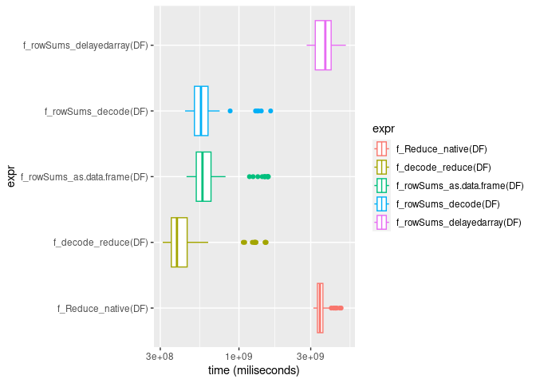

## Purpose

There is no native `rowSums` function for `DataFrame`s of `Rle`-encoded
numerical values.  What is the best strategy for an implementation ?

## Setup


```r
library("CAGEr")   |> suppressPackageStartupMessages()
library("ggplot2") |> suppressPackageStartupMessages()

# DF <- CTSStagCountDF(exampleCAGEexp)
DF <- ZebrafishDevelopmentalCAGE::ZebrafishCAGE |> assay()

f_Reduce_native         <- function(DF) Reduce(`+`, DF, Rle(0L))
f_decode_reduce         <- function(DF) Rle(Reduce(`+`, lapply(DF, decode), 0L))
f_rowSums_as.data.frame <- function(DF) Rle(rowSums(as.data.frame(DF)))
f_rowSums_decode        <- function(DF) Rle(rowSums(data.frame(lapply(DF, decode))))
f_rowSums_delayedarray  <- function(DF) Rle(rowSums(DelayedArray::DelayedArray(DF)))
```

## Benchmark


```r
(microbench_out <- microbenchmark::microbenchmark(times = 100,
  f_Reduce_native(DF),
  f_decode_reduce(DF),
  f_rowSums_as.data.frame(DF),
  f_rowSums_decode(DF),
  f_rowSums_delayedarray(DF)))
```

```
## Unit: milliseconds
##                         expr       min        lq      mean    median        uq
##          f_Reduce_native(DF) 2820.0130 2851.1089 2958.8023 2882.6713 2954.0970
##          f_decode_reduce(DF)  379.0275  387.3549  491.2393  408.6045  452.3557
##  f_rowSums_as.data.frame(DF)  438.7085  456.6085  542.6159  505.9753  561.3461
##         f_rowSums_decode(DF)  428.7342  456.6478  622.6066  531.3930  595.9486
##   f_rowSums_delayedarray(DF) 2745.2522 2877.5242 3424.9081 3558.1666 3664.0597
##       max neval
##  3737.623   100
##  1177.820   100
##  1342.846   100
##  1356.036   100
##  5930.785   100
```

```r
# https://statisticsglobe.com/microbenchmark-package-r
ggplot(microbench_out, aes(x = time, y = expr, color = expr)) +  # Plot performance comparison
  geom_boxplot() + 
  scale_x_log10("time (miliseconds)")
```

<!-- -->

## Result

The winner is:

```
f_decode_reduce <- function(DF) Rle(Reduce(`+`, lapply(DF, decode), 0L))
```

Explained with more verbose code:

```
f_decode_reduce <- function(DF) {
  list_of_numerical_vectors <- lapply(DF, decode)
  parallel_sum              <- Reduce(`+`, list_of_numerical_vectors, 0L)
  result                    <- Rle(parallel_sum)
  return(result)
}
```

## Appendix: asking ChatGPT

After running this benchmark, I asked ChatGPT via Sidekick.  Here is our conversation:

Charles Plessy  10:05 PM

> Good evening, ChatGPT

Sidekick APP  10:05 PM

> Good evening! How can I assist you today?

Charles Plessy  10:06 PM

> Do you know the DataFrame class in the Bioconductor S4Vectors R package?

Sidekick APP  10:06 PM

> Yes, I'm familiar with it. The DataFrame class in the Bioconductor S4Vectors R package is an S4 class for representing a list of vectors of the same length. It's similar to a data frame in base R, but with more features. It's designed to handle genomic data, but can be used for any data that can be organized as a collection of equal-length vectors.

Charles Plessy  10:07 PM

> I use it to store numeric values compressed with the Rle class of the S4Vectors R package.

Sidekick APP  10:07 PM

> Sure, I'd be happy to help!

> The DataFrame class is a part of the S4Vectors package in R, which is a part of the Bioconductor project. It's designed to handle large amounts of data efficiently. It's similar to data.frames in base R, but with some additional features.

> The Rle (Run Length Encoding) class is also a part of the S4Vectors package. It's used to represent a sequence of repeated values in a more memory-efficient way. For example, instead of storing the sequence c(1, 1, 1, 2, 2, 3, 3, 3, 3), you could store it as an Rle object as (3 times 1, 2 times 2, 4 times 3).

> To store numeric values compressed with the Rle class in a DataFrame, you would first create the Rle object, and then include it in the DataFrame. 

> Here's a basic example:

```
R
# Load the S4Vectors package
library(S4Vectors)

# Create an Rle object
rle_object <- Rle(c(1, 1, 1, 2, 2, 3, 3, 3, 3))

# Create a DataFrame with the Rle object
df <- DataFrame(rle_column = rle_object)
```

> In this example, 'df' is a DataFrame that contains a single column ('rle_column') with the compressed numeric values.

> Remember that Rle objects can be more memory-efficient when you have long sequences of repeated values. If your data doesn't have many repeated values, you might not see much benefit from using Rle.

Charles Plessy  10:09 PM

> Can the base function rowSums work on a Bioconductor DataFrame of Rle-encoded values?

Sidekick APP  10:09 PM

> _Thinking... Thanks for waiting!_

Charles Plessy  10:20 PM

> I am waiting but please allow me to repeat my question: can the base function rowSums work on a Bioconductor DataFrame of Rle-encoded values?

Sidekick APP  10:20 PM

> No, the base function `rowSums` in R cannot directly work on a Bioconductor DataFrame of Rle-encoded values. The `rowSums` function is designed to work with numeric matrices or data frames. Rle-encoded values are a type of list, and `rowSums` cannot handle lists directly. You would need to first convert or extract the Rle-encoded values into a numeric matrix or data frame before using `rowSums`.

Charles Plessy  10:22 PM

> Please write for me an efficient function that computes row sums on a Bioconductor DataFrame of Rle-encoded values.

Sidekick APP  10:22 PM

> Sure, here's a simple function in R that computes the row sums on a DataFrame of Rle-encoded values. This function assumes that your DataFrame is named `df` and that it only contains Rle-encoded columns.

```
R
library(DelayedArray)

rowSumsRle <- function(df) {
  # Convert the DataFrame to a matrix
  mat <- as.matrix(df)
  
  # Apply the rowSums function
  result <- rowSums(mat)
  
  return(result)
}
You can use this function like this:
R
sums <- rowSumsRle(df)
```

> This will return a vector where each element is the sum of the corresponding row in the DataFrame. Please note that this function will only work correctly if all columns in the DataFrame are Rle-encoded. If there are any non-Rle-encoded columns, you will need to handle them separately.

Charles Plessy  10:26 PM

> Thank you, can you write one function that is more computationally efficient?

Sidekick APP  10:26 PM

> Sure, here's a simple example of how you might do this in R. This function uses the `rowSums` function, which is a highly optimized function for computing row sums in R. It first decodes the Rle-encoded values using the `runValue` function from the Bioconductor package, then computes the row sums.

```
R
library(Bioconductor)

computeRowSums <- function(df) {
  # Decode Rle-encoded values
  decoded_values <- lapply(df, function(x) { runValue(x) })
  
  # Convert list to data frame
  decoded_df <- do.call(cbind.data.frame, decoded_values)
  
  # Compute row sums
  row_sums <- rowSums(decoded_df)
  
  return(row_sums)
}
```

> Please note that this function assumes that all columns in the input data frame are Rle-encoded. If this is not the case, you may need to add some additional error checking to handle columns that are not Rle-encoded.

Charles Plessy  10:29 PM

> Thank you again. I would like to make a benchmark with different approaches. Can you propose a third alternative that uses a different algorithm^

Sidekick APP  10:29 PM

> Sure, here's an alternative function using the `rowSums` function in R. This function will first decode the Rle-encoded values, then compute the row sums. Please note that this function assumes that your DataFrame is named `df` and that all columns contain Rle-encoded values.

```
R
library(DelayedArray)

computeRowSums <- function(df) {
  # Decode Rle-encoded values
  decoded_df <- as.data.frame(lapply(df, function(x) unlist(runValue(x))))
  
  # Compute row sums
  row_sums <- rowSums(decoded_df)
  
  return(row_sums)
}

# Usage
row_sums <- computeRowSums(df)
```

> This function uses the `lapply` function to apply the decoding function to each column of the DataFrame. The `unlist` and `runValue` functions are used to decode the Rle-encoded values. The `rowSums` function is then used to compute the row sums. Please replace `df` with your actual DataFrame name.

### But the functions do not work...


```r
rowSumsRle <- function(df) {
  # Convert the DataFrame to a matrix
  mat <- as.matrix(df)
  
  # Apply the rowSums function
  result <- rowSums(mat)
  
  return(result)
}
```

```
> rowSumsRle(DF)

 Error in base::rowSums(x, na.rm = na.rm, dims = dims, ...) : 
  'x' must be an array of at least two dimensions
```


```r
computeRowSums <- function(df) {
  # Decode Rle-encoded values
  decoded_values <- lapply(df, function(x) { runValue(x) })
  
  # Convert list to data frame
  decoded_df <- do.call(cbind.data.frame, decoded_values)
  
  # Compute row sums
  row_sums <- rowSums(decoded_df)
  
  return(row_sums)
}
```

```
> computeRowSums(DF)
Error in data.frame(..., check.names = FALSE) : 
  arguments imply differing number of rows: 796039, 952755, 971432, 1077882, 890977, 930738, 933017, 926733, 579846, 1449206, 1308034, 1260173
```


```r
computeRowSums <- function(df) {
  # Decode Rle-encoded values
  decoded_df <- as.data.frame(lapply(df, function(x) unlist(runValue(x))))
  
  # Compute row sums
  row_sums <- rowSums(decoded_df)
  
  return(row_sums)
}
```

```
> computeRowSums(DF)

 Error in (function (..., row.names = NULL, check.rows = FALSE, check.names = TRUE,  : 
  arguments imply differing number of rows: 796039, 952755, 971432, 1077882, 890977, 930738, 933017, 926733, 579846, 1449206, 1308034, 1260173
```
