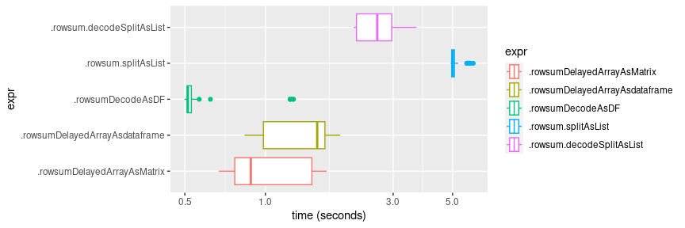

## Purpose

There is no native `rowsum` function for `DataFrame`s of `Rle`-encoded
numerical values.  What is the best strategy for an implementation ?

## Setup


```r
library("CAGEr")   |> suppressPackageStartupMessages()
library("ggplot2") |> suppressPackageStartupMessages()
```

The DataFrame encodes counts of CAGE tags mapped on the zebrafish genome.


```r
# (DF <- CTSStagCountDF(exampleCAGEexp))
# DF[[1]]
# 
# (names <- CTSScoordinatesGR(exampleCAGEexp)$cluster)

(DF <- ZebrafishDevelopmentalCAGE::ZebrafishCAGE |> assay())
```

```
## DataFrame with 3552111 rows and 12 columns
##         zf_unfertilized_egg zf_fertilized_egg zf_64cells zf_512cells zf_high
##                       <Rle>             <Rle>      <Rle>       <Rle>   <Rle>
## 1                         0                 2          0           0       0
## 2                         0                 0          1           0       0
## 3                         0                 0          0           0       0
## 4                         0                 0          0           0       0
## 5                         0                 0          0           0       0
## ...                     ...               ...        ...         ...     ...
## 3552107                   0                 0          0           1       0
## 3552108                   0                 0          0           0       0
## 3552109                   0                 0          0           0       0
## 3552110                   1                 0          0           0       0
## 3552111                   0                 0          0           0       0
##         zf_oblong zf_sphere_dome zf_30perc_dome zf_shield zf_14somites zf_prim6
##             <Rle>          <Rle>          <Rle>     <Rle>        <Rle>    <Rle>
## 1               0              0              0         0            0        0
## 2               0              0              0         0            0        0
## 3               0              0              0         1            0        0
## 4               0              0              0         0            0        0
## 5               0              0              0         0            0        1
## ...           ...            ...            ...       ...          ...      ...
## 3552107         0              0              0         0            0        0
## 3552108         0              0              0         0            1        0
## 3552109         0              1              0         0            0        0
## 3552110         0              0              0         0            0        0
## 3552111         0              0              0         0            1        0
##         zf_prim20
##             <Rle>
## 1               0
## 2               0
## 3               0
## 4               1
## 5               2
## ...           ...
## 3552107         0
## 3552108         0
## 3552109         0
## 3552110         0
## 3552111         0
```

```r
DF[[1]]
```

```
## integer-Rle of length 3552111 with 796039 runs
##   Lengths: 53  1 64  1  9  1  1  1  1  1  2 ...  3  1  1  3  1 33  1 78  1  1
##   Values :  0  1  0  1  0  1  0  1  0  5  0 ...  0  2  1  0  2  0  1  0  1  0
```

```r
# Artificial example.
(names <- rep(CTSScoordinatesGR(exampleCAGEexp)$cluster, 711)[1:nrow(DF)])
```

```
## character-Rle of length 3552111 with 571848 runs
##   Lengths:                        1 ...                        3
##   Values :       "chr17:26027430:+" ... "chr17:28166212-28166.."
```

The functions:


```r
.rowsumDelayedArrayAsMatrix <- function(x, group, reorder = TRUE)
  rowsum(
    as.matrix(DelayedArray::DelayedArray(x)),
    group,
    reorder = reorder) |> DataFrame()
.rowsumDelayedArrayAsMatrix(DF, decode(names), reorder = FALSE) |> head()
```

```
## DataFrame with 6 rows and 12 columns
##                  zf_unfertilized_egg zf_fertilized_egg zf_64cells zf_512cells
##                            <integer>         <integer>  <integer>   <integer>
## chr17:26027430:+                 418               572        512         473
## chr17:26050540:+                 484               762       1137        1141
## chr17:26118088:+                 530               619        937         824
## chr17:26142853:+                 494               607        647         652
## chr17:26166954:+                 491               520        610         512
## chr17:26222417:+                 326               414       1015         785
##                    zf_high zf_oblong zf_sphere_dome zf_30perc_dome zf_shield
##                  <integer> <integer>      <integer>      <integer> <integer>
## chr17:26027430:+       461       392            373            386       152
## chr17:26050540:+       627       733            763            805       364
## chr17:26118088:+       588       615            588            651       246
## chr17:26142853:+       622       513            452            526       190
## chr17:26166954:+       454       419            725            777       355
## chr17:26222417:+       454       392            513            547       242
##                  zf_14somites  zf_prim6 zf_prim20
##                     <integer> <integer> <integer>
## chr17:26027430:+          550       617       433
## chr17:26050540:+         1573      1335      1055
## chr17:26118088:+         1251      2319      1054
## chr17:26142853:+         1297       952       762
## chr17:26166954:+          941       932       814
## chr17:26222417:+         1240      4282       939
```

```r
.rowsumDelayedArrayAsdataframe <- function(x, group, reorder = TRUE)
  rowsum(
    as.data.frame(DelayedArray::DelayedArray(x)),
    group,
    reorder = reorder) |> DataFrame()
.rowsumDelayedArrayAsdataframe(DF, decode(names), reorder = FALSE) |> head()
```

```
## DataFrame with 6 rows and 12 columns
##                  zf_unfertilized_egg zf_fertilized_egg zf_64cells zf_512cells
##                            <integer>         <integer>  <integer>   <integer>
## chr17:26027430:+                 418               572        512         473
## chr17:26050540:+                 484               762       1137        1141
## chr17:26118088:+                 530               619        937         824
## chr17:26142853:+                 494               607        647         652
## chr17:26166954:+                 491               520        610         512
## chr17:26222417:+                 326               414       1015         785
##                    zf_high zf_oblong zf_sphere_dome zf_30perc_dome zf_shield
##                  <integer> <integer>      <integer>      <integer> <integer>
## chr17:26027430:+       461       392            373            386       152
## chr17:26050540:+       627       733            763            805       364
## chr17:26118088:+       588       615            588            651       246
## chr17:26142853:+       622       513            452            526       190
## chr17:26166954:+       454       419            725            777       355
## chr17:26222417:+       454       392            513            547       242
##                  zf_14somites  zf_prim6 zf_prim20
##                     <integer> <integer> <integer>
## chr17:26027430:+          550       617       433
## chr17:26050540:+         1573      1335      1055
## chr17:26118088:+         1251      2319      1054
## chr17:26142853:+         1297       952       762
## chr17:26166954:+          941       932       814
## chr17:26222417:+         1240      4282       939
```

```r
.rowsumDecodeAsDF <- function(x, group, reorder = TRUE)
  rowsum(
    as.data.frame(lapply(x, decode)),
    group,
    reorder = reorder) |> DataFrame()
.rowsumDecodeAsDF(DF, decode(names), reorder = FALSE) |> head()
```

```
## DataFrame with 6 rows and 12 columns
##                  zf_unfertilized_egg zf_fertilized_egg zf_64cells zf_512cells
##                            <integer>         <integer>  <integer>   <integer>
## chr17:26027430:+                 418               572        512         473
## chr17:26050540:+                 484               762       1137        1141
## chr17:26118088:+                 530               619        937         824
## chr17:26142853:+                 494               607        647         652
## chr17:26166954:+                 491               520        610         512
## chr17:26222417:+                 326               414       1015         785
##                    zf_high zf_oblong zf_sphere_dome zf_30perc_dome zf_shield
##                  <integer> <integer>      <integer>      <integer> <integer>
## chr17:26027430:+       461       392            373            386       152
## chr17:26050540:+       627       733            763            805       364
## chr17:26118088:+       588       615            588            651       246
## chr17:26142853:+       622       513            452            526       190
## chr17:26166954:+       454       419            725            777       355
## chr17:26222417:+       454       392            513            547       242
##                  zf_14somites  zf_prim6 zf_prim20
##                     <integer> <integer> <integer>
## chr17:26027430:+          550       617       433
## chr17:26050540:+         1573      1335      1055
## chr17:26118088:+         1251      2319      1054
## chr17:26142853:+         1297       952       762
## chr17:26166954:+          941       932       814
## chr17:26222417:+         1240      4282       939
```

```r
# https://support.bioconductor.org/p/99960/#100034
.rowsum.splitAsList <- function(x, group, reorder=TRUE, ...)
    lapply(x, function(col) sum(splitAsList(col, group))) |> DataFrame()
.rowsum.splitAsList(DF, decode(names), reorder = FALSE) |> head()
```

```
## DataFrame with 6 rows and 12 columns
##                  zf_unfertilized_egg zf_fertilized_egg zf_64cells zf_512cells
##                            <integer>         <integer>  <integer>   <integer>
## chr17:26027430:+                 418               572        512         473
## chr17:26050540:+                 484               762       1137        1141
## chr17:26118088:+                 530               619        937         824
## chr17:26142853:+                 494               607        647         652
## chr17:26166954:+                 491               520        610         512
## chr17:26222417:+                 326               414       1015         785
##                    zf_high zf_oblong zf_sphere_dome zf_30perc_dome zf_shield
##                  <integer> <integer>      <integer>      <integer> <integer>
## chr17:26027430:+       461       392            373            386       152
## chr17:26050540:+       627       733            763            805       364
## chr17:26118088:+       588       615            588            651       246
## chr17:26142853:+       622       513            452            526       190
## chr17:26166954:+       454       419            725            777       355
## chr17:26222417:+       454       392            513            547       242
##                  zf_14somites  zf_prim6 zf_prim20
##                     <integer> <integer> <integer>
## chr17:26027430:+          550       617       433
## chr17:26050540:+         1573      1335      1055
## chr17:26118088:+         1251      2319      1054
## chr17:26142853:+         1297       952       762
## chr17:26166954:+          941       932       814
## chr17:26222417:+         1240      4282       939
```

```r
.rowsum.decodeSplitAsList <- function(x, group, reorder=TRUE, ...)
    lapply(lapply(x, decode), function(col) sum(splitAsList(col, group))) |> DataFrame()
.rowsum.decodeSplitAsList(DF, decode(names), reorder = FALSE) |> head()
```

```
## DataFrame with 6 rows and 12 columns
##                  zf_unfertilized_egg zf_fertilized_egg zf_64cells zf_512cells
##                            <integer>         <integer>  <integer>   <integer>
## chr17:26027430:+                 418               572        512         473
## chr17:26050540:+                 484               762       1137        1141
## chr17:26118088:+                 530               619        937         824
## chr17:26142853:+                 494               607        647         652
## chr17:26166954:+                 491               520        610         512
## chr17:26222417:+                 326               414       1015         785
##                    zf_high zf_oblong zf_sphere_dome zf_30perc_dome zf_shield
##                  <integer> <integer>      <integer>      <integer> <integer>
## chr17:26027430:+       461       392            373            386       152
## chr17:26050540:+       627       733            763            805       364
## chr17:26118088:+       588       615            588            651       246
## chr17:26142853:+       622       513            452            526       190
## chr17:26166954:+       454       419            725            777       355
## chr17:26222417:+       454       392            513            547       242
##                  zf_14somites  zf_prim6 zf_prim20
##                     <integer> <integer> <integer>
## chr17:26027430:+          550       617       433
## chr17:26050540:+         1573      1335      1055
## chr17:26118088:+         1251      2319      1054
## chr17:26142853:+         1297       952       762
## chr17:26166954:+          941       932       814
## chr17:26222417:+         1240      4282       939
```

```r
# This one I thought about after asking ChatGPT for a splitAsList alternative
.rowsum.splitAndColSums <- function(x, group, reorder=TRUE, ...) {
  l <- split(x, group)
  ll <- lapply(l, \(l) sapply(l, sum))
  do.call(rbind, ll) |> DataFrame()
}
.rowsum.splitAndColSums(DF, decode(names), reorder = FALSE) |> head()
```

```
## DataFrame with 6 rows and 12 columns
##                  zf_unfertilized_egg zf_fertilized_egg zf_64cells zf_512cells
##                            <integer>         <integer>  <integer>   <integer>
## chr17:26027430:+                 418               572        512         473
## chr17:26050540:+                 484               762       1137        1141
## chr17:26118088:+                 530               619        937         824
## chr17:26142853:+                 494               607        647         652
## chr17:26166954:+                 491               520        610         512
## chr17:26222417:+                 326               414       1015         785
##                    zf_high zf_oblong zf_sphere_dome zf_30perc_dome zf_shield
##                  <integer> <integer>      <integer>      <integer> <integer>
## chr17:26027430:+       461       392            373            386       152
## chr17:26050540:+       627       733            763            805       364
## chr17:26118088:+       588       615            588            651       246
## chr17:26142853:+       622       513            452            526       190
## chr17:26166954:+       454       419            725            777       355
## chr17:26222417:+       454       392            513            547       242
##                  zf_14somites  zf_prim6 zf_prim20
##                     <integer> <integer> <integer>
## chr17:26027430:+          550       617       433
## chr17:26050540:+         1573      1335      1055
## chr17:26118088:+         1251      2319      1054
## chr17:26142853:+         1297       952       762
## chr17:26166954:+          941       932       814
## chr17:26222417:+         1240      4282       939
```

```r
.rowsum.splitAndColSums(endoapply(DF, decode), decode(names), reorder = FALSE) |> head()
```

```
## DataFrame with 6 rows and 12 columns
##                  zf_unfertilized_egg zf_fertilized_egg zf_64cells zf_512cells
##                            <integer>         <integer>  <integer>   <integer>
## chr17:26027430:+                 418               572        512         473
## chr17:26050540:+                 484               762       1137        1141
## chr17:26118088:+                 530               619        937         824
## chr17:26142853:+                 494               607        647         652
## chr17:26166954:+                 491               520        610         512
## chr17:26222417:+                 326               414       1015         785
##                    zf_high zf_oblong zf_sphere_dome zf_30perc_dome zf_shield
##                  <integer> <integer>      <integer>      <integer> <integer>
## chr17:26027430:+       461       392            373            386       152
## chr17:26050540:+       627       733            763            805       364
## chr17:26118088:+       588       615            588            651       246
## chr17:26142853:+       622       513            452            526       190
## chr17:26166954:+       454       419            725            777       355
## chr17:26222417:+       454       392            513            547       242
##                  zf_14somites  zf_prim6 zf_prim20
##                     <integer> <integer> <integer>
## chr17:26027430:+          550       617       433
## chr17:26050540:+         1573      1335      1055
## chr17:26118088:+         1251      2319      1054
## chr17:26142853:+         1297       952       762
## chr17:26166954:+          941       932       814
## chr17:26222417:+         1240      4282       939
```

## Benchmark


```r
(microbench_out <- microbenchmark::microbenchmark(
  times = 100,
  .rowsumDelayedArrayAsMatrix = .rowsumDelayedArrayAsMatrix(DF, decode(names), reorder = FALSE),
  .rowsumDelayedArrayAsdataframe = .rowsumDelayedArrayAsdataframe(DF, decode(names), reorder = FALSE),
  .rowsumDecodeAsDF = .rowsumDecodeAsDF(DF, decode(names), reorder = FALSE),
  .rowsum.splitAsList = .rowsum.splitAsList(DF, decode(names), reorder = FALSE),
  .rowsum.decodeSplitAsList = .rowsum.decodeSplitAsList(DF, decode(names), reorder = FALSE) #,
  # Interesting, # .rowsum.splitAndColSums = .rowsum.splitAndColSums(DF, decode(names), reorder = FALSE),
  # but too slow # .rowsum.DecodeSplitAndColSums = .rowsum.splitAndColSums(endoapply(DF, decode), decode(names), reorder = FALSE)
))
```

```
## Unit: milliseconds
##                            expr       min        lq      mean    median
##     .rowsumDelayedArrayAsMatrix  670.0519  767.4457 1095.5916  882.0108
##  .rowsumDelayedArrayAsdataframe  835.3315  982.0086 1335.5997 1561.0492
##               .rowsumDecodeAsDF  498.6539  509.8449  556.0318  513.3068
##             .rowsum.splitAsList 4916.0498 4964.3569 5126.3069 5013.1646
##       .rowsum.decodeSplitAsList 2133.9391 2185.7487 2600.7488 2624.4384
##         uq      max neval
##  1491.9984 1691.589   100
##  1668.5892 1902.639   100
##   528.9106 1273.422   100
##  5080.1585 5973.912   100
##  2962.9610 3661.528   100
```

```r
# https://statisticsglobe.com/microbenchmark-package-r
ggplot(microbench_out, aes(x = time / 1e9, y = expr, color = expr)) +  # Plot performance comparison
  geom_boxplot() + 
  scale_x_log10("time (seconds)")
```

<!-- -->

## Result

The winner is:

```
.rowsumDecodeAsDF <- function(x, group, reorder = TRUE)
  rowsum(
    as.data.frame(lapply(x, decode)),
    group,
    reorder = reorder) |> DataFrame()
```

Needless to say, the `reorder` argument needs to be implemented with care.

## Session information


```r
sessionInfo()
```

```
## R version 4.3.0 (2023-04-21)
## Platform: x86_64-pc-linux-gnu (64-bit)
## Running under: Debian GNU/Linux 12 (bookworm)
## 
## Matrix products: default
## BLAS:   /usr/lib/x86_64-linux-gnu/blas/libblas.so.3.11.0 
## LAPACK: /usr/lib/x86_64-linux-gnu/lapack/liblapack.so.3.11.0
## 
## locale:
##  [1] LC_CTYPE=en_US.UTF-8       LC_NUMERIC=C              
##  [3] LC_TIME=en_US.UTF-8        LC_COLLATE=en_US.UTF-8    
##  [5] LC_MONETARY=en_US.UTF-8    LC_MESSAGES=en_US.UTF-8   
##  [7] LC_PAPER=en_US.UTF-8       LC_NAME=C                 
##  [9] LC_ADDRESS=C               LC_TELEPHONE=C            
## [11] LC_MEASUREMENT=en_US.UTF-8 LC_IDENTIFICATION=C       
## 
## time zone: Etc/UTC
## tzcode source: system (glibc)
## 
## attached base packages:
## [1] stats4    stats     graphics  grDevices utils     datasets  methods  
## [8] base     
## 
## other attached packages:
##  [1] ggplot2_3.4.2               CAGEr_2.6.0                
##  [3] MultiAssayExperiment_1.26.0 SummarizedExperiment_1.30.2
##  [5] Biobase_2.60.0              GenomicRanges_1.52.0       
##  [7] GenomeInfoDb_1.36.1         IRanges_2.34.1             
##  [9] S4Vectors_0.38.1            BiocGenerics_0.46.0        
## [11] MatrixGenerics_1.12.2       matrixStats_1.0.0          
## 
## loaded via a namespace (and not attached):
##   [1] RColorBrewer_1.1-3                 rstudioapi_0.14                   
##   [3] jsonlite_1.8.5                     magrittr_2.0.3                    
##   [5] GenomicFeatures_1.52.1             farver_2.1.1                      
##   [7] rmarkdown_2.22                     BiocIO_1.10.0                     
##   [9] zlibbioc_1.46.0                    vctrs_0.6.2                       
##  [11] memoise_2.0.1                      Rsamtools_2.16.0                  
##  [13] DelayedMatrixStats_1.22.1          RCurl_1.98-1.12                   
##  [15] base64enc_0.1-3                    htmltools_0.5.5                   
##  [17] S4Arrays_1.0.4                     progress_1.2.2                    
##  [19] curl_5.0.1                         Formula_1.2-5                     
##  [21] sass_0.4.6                         KernSmooth_2.23-20                
##  [23] bslib_0.5.0                        htmlwidgets_1.6.2                 
##  [25] plyr_1.8.8                         Gviz_1.44.0                       
##  [27] cachem_1.0.8                       GenomicAlignments_1.36.0          
##  [29] lifecycle_1.0.3                    pkgconfig_2.0.3                   
##  [31] Matrix_1.5-3                       R6_2.5.1                          
##  [33] fastmap_1.1.1                      GenomeInfoDbData_1.2.10           
##  [35] digest_0.6.31                      colorspace_2.1-0                  
##  [37] AnnotationDbi_1.62.1               Hmisc_5.1-0                       
##  [39] RSQLite_2.3.1                      vegan_2.6-4                       
##  [41] filelock_1.0.2                     fansi_1.0.4                       
##  [43] mgcv_1.8-41                        httr_1.4.6                        
##  [45] compiler_4.3.0                     microbenchmark_1.4.10             
##  [47] withr_2.5.0                        bit64_4.0.5                       
##  [49] htmlTable_2.4.1                    backports_1.4.1                   
##  [51] CAGEfightR_1.20.0                  BiocParallel_1.34.2               
##  [53] DBI_1.1.3                          highr_0.10                        
##  [55] biomaRt_2.56.1                     MASS_7.3-58.2                     
##  [57] rappdirs_0.3.3                     DelayedArray_0.26.4               
##  [59] rjson_0.2.21                       permute_0.9-7                     
##  [61] gtools_3.9.4                       tools_4.3.0                       
##  [63] foreign_0.8-84                     nnet_7.3-18                       
##  [65] glue_1.6.2                         restfulr_0.0.15                   
##  [67] nlme_3.1-162                       stringdist_0.9.10                 
##  [69] grid_4.3.0                         checkmate_2.2.0                   
##  [71] reshape2_1.4.4                     cluster_2.1.4                     
##  [73] generics_0.1.3                     operator.tools_1.6.3              
##  [75] gtable_0.3.3                       BSgenome_1.68.0                   
##  [77] formula.tools_1.7.1                ensembldb_2.24.0                  
##  [79] ZebrafishDevelopmentalCAGE_0.999.0 data.table_1.14.8                 
##  [81] hms_1.1.3                          xml2_1.3.4                        
##  [83] utf8_1.2.3                         XVector_0.40.0                    
##  [85] pillar_1.9.0                       stringr_1.5.0                     
##  [87] splines_4.3.0                      dplyr_1.1.2                       
##  [89] BiocFileCache_2.8.0                lattice_0.20-45                   
##  [91] rtracklayer_1.60.0                 bit_4.0.5                         
##  [93] deldir_1.0-9                       biovizBase_1.48.0                 
##  [95] tidyselect_1.2.0                   Biostrings_2.68.1                 
##  [97] knitr_1.43                         gridExtra_2.3                     
##  [99] ProtGenerics_1.32.0                xfun_0.39                         
## [101] stringi_1.7.12                     VGAM_1.1-8                        
## [103] lazyeval_0.2.2                     yaml_2.3.7                        
## [105] som_0.3-5.1                        evaluate_0.21                     
## [107] codetools_0.2-19                   interp_1.1-4                      
## [109] tibble_3.2.1                       cli_3.6.1                         
## [111] rpart_4.1.19                       munsell_0.5.0                     
## [113] jquerylib_0.1.4                    dichromat_2.0-0.1                 
## [115] Rcpp_1.0.10                        dbplyr_2.3.2                      
## [117] png_0.1-8                          XML_3.99-0.14                     
## [119] parallel_4.3.0                     assertthat_0.2.1                  
## [121] blob_1.2.4                         prettyunits_1.1.1                 
## [123] latticeExtra_0.6-30                jpeg_0.1-10                       
## [125] AnnotationFilter_1.24.0            sparseMatrixStats_1.12.1          
## [127] bitops_1.0-7                       VariantAnnotation_1.46.0          
## [129] scales_1.2.1                       crayon_1.5.2                      
## [131] rlang_1.1.1                        KEGGREST_1.40.0
```

## ChatGPT

Charles Plessy  7:52 PM

> Good evening ChatGPT, can you tell me an alternative to the Bioconductor function `splitAsList` ?

Sidekick APP  7:52 PM

> An alternative to the `splitAsList` function from Bioconductor in R could be the combination of the `split` and `as.list` functions from base R. Here's an example:

```
r
# Assuming 'df' is your data frame and 'group' is the column you want to split by
split_list = as.list(split(df, df$group))
```

> This will give you a list of data frames, split by the 'group' column, similar to what `splitAsList` would do.
