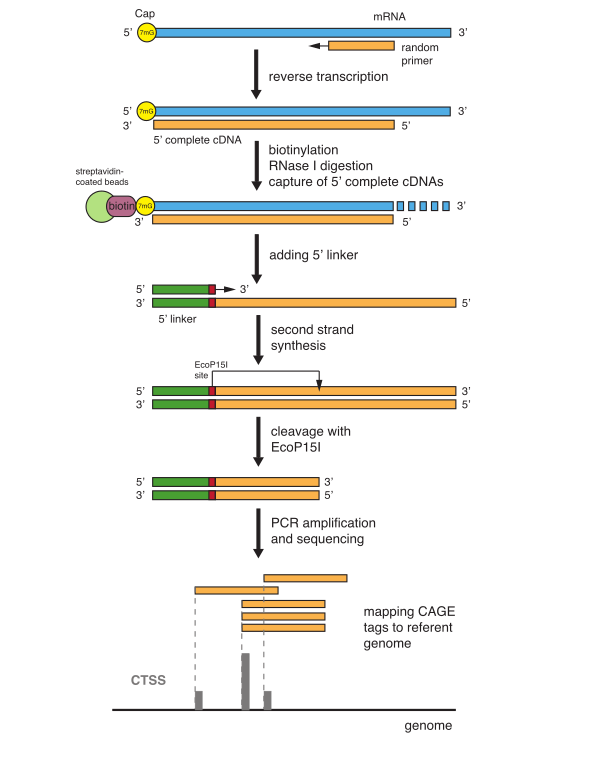
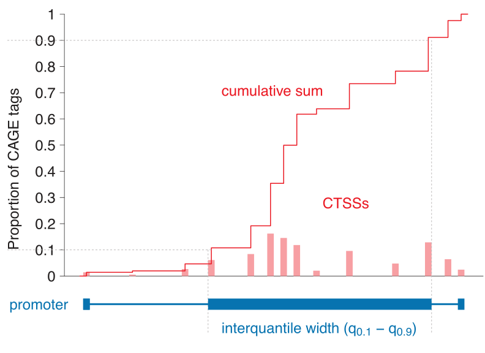
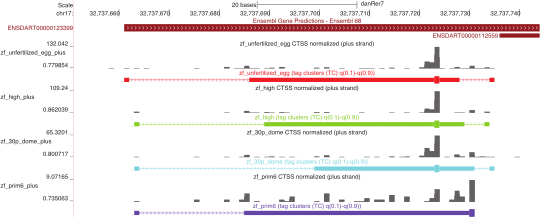
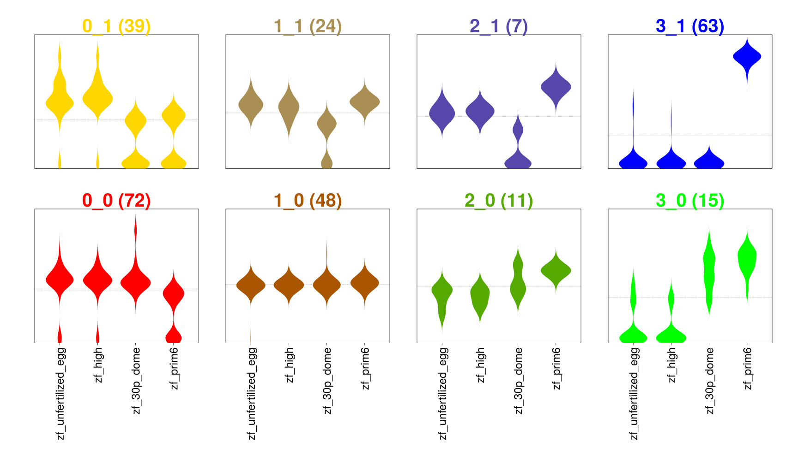
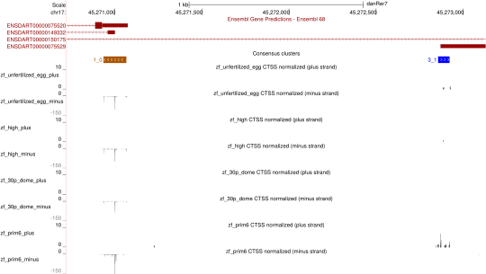
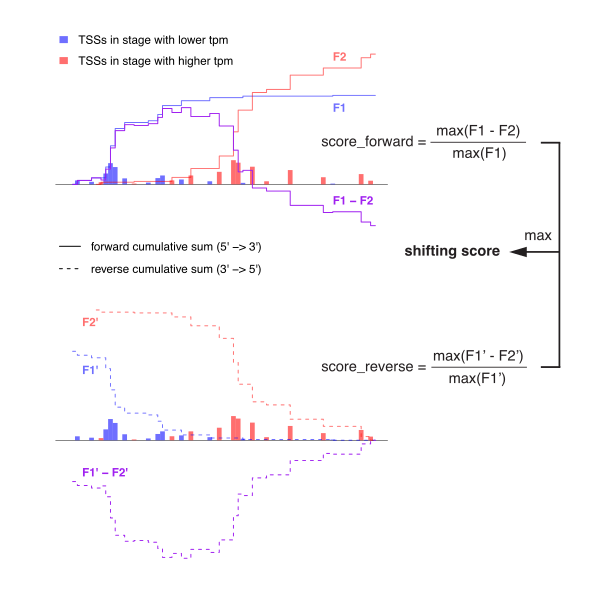
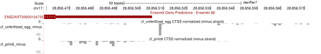

```{r setup, echo = FALSE, results = "hide"}
options(signif = 3, digits = 3)
knitr::opts_chunk$set(tidy = FALSE, cache = TRUE, autodep = TRUE, fig.height = 5.5,
                      message = FALSE, error = FALSE, warning = TRUE)
set.seed(0xdada)
```

Introduction
============

This document briefly how to use `r Biocpkg("CAGEr")` _CAGEr_, a Bioconductor package designed
to process, analyse and visualise Cap Analysis of Gene Expression (CAGE)sequencing data.
CAGE [@Kodzius:2006] is a high-throughput method for transcriptome analysis that utilizes
_cap trapping_ [@Carninci:1996], a technique based on the biotinylation of the 7-methylguanosine
cap of Pol II transcripts, to pulldown the 5′-complete cDNAs reversely transcribed from
the captured transcripts.  A linker sequence is ligated to the 5′ end of the cDNA and a specific
restriction enzyme is used to cleave off a short fragment from the 5′ end.  Resulting fragments
are then amplified and sequenced using massive parallel high-throughput sequencing technology,
which results in a large number of short sequenced tags that can be mapped back to the referent
genome to infer the exact position of the transcription start sites (TSSs) used for transcription
of captured RNAs (Figure \@ref(fig:CAGEprotocol)).  The number of CAGE tags supporting each TSS
gives the information on the relative frequency of its usage and can be used as a measure of
expression from that specific TSS.  Thus, CAGE provides information on two aspects of capped
transcriptome: genome-wide 1bp-resolution map of TSSs and transcript expression levels. This
information can be used for various analyses, from 5′ centered expression profiling
[@Takahashi:2012] to studying promoter architecture [@Carninci:2006].

```{r CAGEprotocol, echo=FALSE, fig.align="center", fig.cap="Overview of CAGE experiment"}

```

CAGE samples derived from various organisms (genomes) can be analysed by _CAGEr_ and the only
limitation is the availability of the referent genome as a `r Biocpkg("BSgenome")` package in case
when raw mapped CAGE tags are processed.  _CAGEr_ provides a comprehensive workflow that starts from
mapped CAGE tags and includes reconstruction of TSSs and promoters and their visualisation, as well
as more specialized downstream analyses like promoter width, expression profiling and differential
TSS usage. It can use both Binary Sequence Alignment Map (BAM) files of aligned CAGE tags or files
with genomic locations of TSSs and number of supporting CAGE tags as input. If BAM files are provided
_CAGEr_ constructs TSSs from aligned CAGE tags and counts the number of tags supporting each TSS,
while allowing filtering out low-quality tags and removing technology-specific bias.  It further
performs normalization of raw CAGE tag count, clustering of TSSs into tag clusters (TC) and their
aggregation across multiple CAGE experiments into promoters to construct the promoterome. Various
methods for normalization and clustering of TSSs are supported. Exporting data into different types
of track files allows various visualisations of TSSs and clusters (promoters) in the UCSC Genome
Browser, which facilitate generation of hypotheses. _CAGEr_ manipulates multiple CAGE experiments 
at once and performs analyses across datasets, including expression profiling and detection of
differential TSS usage (promoter shifting). Multicore option for parallel processing is supported on
Unix-like platforms, which significantly reduces computing time.

Here are some of the functionalities provided in this package:

 * Reading in multiple CAGE datasets from various sources; user provided BAM or TSS input files,
   public CAGE datasets from accompanying data package.
 
 * Correcting systematic G nucleotide addition bias at the 5′ end of CAGE tags.
 
 * Plotting pairwise scatter plots, calculating correlation between datasets and merging datasets.
 
 * Normalizing raw CAGE tag count: simple tag per million (tpm) or power-law based normalization
   [@Balwierz:2009].
 
 * Clustering individual TSSs into tag clusters (TCs) and aggregating clusters across multiple CAGE
   datasets to create a set of consensus promoters.
 
 * Making bedGraph or BED files of individual TSSs or clusters for visualisation in the genome
   browser.
 
 * Expression clustering of individual TSSs or consensus promoters into distinct expression
   profiles using common clustering algorithms.
 
 * Calculating promoter width based on the cumulative distribution of CAGE signal along the
   promoter.
 
 * Scoring and statistically testing differential TSS usage (promoter shifting) and detecting
   promoters that shift between two samples.

Several data packages are accompanying _CAGEr_ package. They contain majority of the up-to-date
publicly available CAGE data produced by major consortia including FANTOM and ENCODE. These include
`r Biocpkg("FANTOM3and4CAGE")` package available from Bioconductor, as well as
`r Biocpkg("ENCODEprojectCAGE")` and `r Biocpkg("ZebrafishDevelopmentalCAGE")` packages
available from <http://promshift.genereg.net/CAGEr/>. In addition, direct fetching of TSS data from
FANTOM5 web resource (the largest collection of TSS data for human and mouse) from within _CAGEr_ is
also available. These are all valuable resources of genome-wide TSSs in various tissue/cell types
for various model organisms that can be used directly in R. Section 5 in this vignette describes how
these public datasets can be included into a workflow provided by _CAGEr_. For further
information on the content of the data packages and the list of available CAGE datasets please refer
to the vignette of the corresponding data package.

For further details on the implemented methods and for citing the _CAGEr_ package in your work
please refer to [@Haberle:2015].


Input data for _CAGEr_ {#input-formats}
=======================================

_CAGEr_ package supports three types of CAGE data input:

 * _Sequenced CAGE tags mapped to the genome_: either BAM (Binary Sequence Alignment Map) files of
   sequenced CAGE tags aligned to the referent genome (including the paired-end data such as
   CAGEscan) or BED files of CAGE tags (fragments).
 
 * _CAGE detected TSSs (CTSSs)_: tab separated files with genomic coordinates of TSSs and number of
   tags supporting each TSS. The file should not contain a header and the data must be organized in
   four columns:
    - name of the chromosome: names must match the names of chromosomes in the corresponding
      _BSgenome_ package.
    - 1-based coordinate of the TSS on the chromosome
    - genomic strand: should be either + or -
    - number of CAGE tags supporting that TSS

 * _Publicly available CAGE datasets from R data package_: Several data packages containing CAGE
   data for various organisms produced by major consortia are accompanying this package. Selected
   subset of these data can be used as input for \Rpackage{CAGEr}.

The type and the format of the input files is specified at the beginning of the workflow, when the
`CAGEset` object is created (section 4.2). This is done by setting the `inputFilesType` argument,
which accepts the following self-explanatory options referring to formats mentioned above:
`"bam", "bamPairedEnd", "bed", "ctss", "CTSStable"`.

In addition, the package provides a method for coercing a `data.frame` object containing single
base-pair TSS information into a `CAGEset` object (as described in section 4.2.1), which can be
further used in the workflow described below. 


The _CAGEr_ workflow
====================

Getting started
---------------

We start the workflow by creating a _CAGEexp_ object, which is a container
for storing CAGE datasets and all the results that will be generated by applying specific functions.
The _CAGEexp_ objects are an extension of the `r Biocpkg("MultiAssayExperiment")` class, and
therefore can use all their methods.  The expression data is stored in _CAGEexp_ using
`r Biocpkg("SummarizedExperiment")` objects, and can also access their methods.

To load the _CAGEr_ package and the other libraries into your R envirnoment type:

```{r load_CAGEr}
library("MultiAssayExperiment")
library("SummarizedExperiment")
library(CAGEr)
```

Creating a _CAGEexp_ object {#create-CAGEexp}
---------------------------------------------

### Specifying a genome assembly

In this tutorial we will be using data from zebrafish _Danio rerio_ that was mapped to the
danRer7 assembly of the genome.  Therefore, the corresponding genome package 
`r Biocpkg("BSgenome.Drerio.UCSC.danRer7")` has to be installed.  It will be automatically
loaded by _CAGEr_ commands when needed.

In case the data is mapped to a genome that is not readily available through _BSgenome_ package
(not in the list returned by `BSgenome::available.genomes()` function), a custom _BSgenome_ package
has to be build and installed first. (See the vignette within the _BSgenome_ package for
instructions on how to build a custom genome package). The `genomeName` argument can then be set to
the name of the build genome package when creating a `CAGEexp` object (see the section
_Creating `CAGEexp` object_ below).

The _BSgenome_ package is used to access information about the chromosomes (length, circularity).
By default, _CAGEr_ will discard alignments that are not on chromosomes named in the _BSgenome_
package.  The `genomeName` argument can be set to `NULL` in order to suppress this behaviour,
or as a last resort when no _BSgenome_ package is available.  However, _CAGEr_ functions that
need access to the genome sequence, for instance for _G-correction_ will not work in that case.

### Specifying input files

The subset of zebrafish (_Danio rerio_) developmental time-series CAGE data generated by
[@Nepal:2013] will be used in the following demonstration of the _CAGEr_ workflow.

Files with genomic coordinates of TSSs detected by CAGE in 4 zebrafish developmental stages are
included in this package in the `extdata` subdirectory.  The files contain TSSs from a part of
chromosome 17 (26,000,000-46,000,000), and there are two files for one of the developmental stages
(two independent replicas). The data in files is organized in four tab-separated columns as
described above in section \@ref(input-formats).  First we have provide information about
input files, sample names, etc. in a `DataFrame` object.

```{r specify_input_files}
ce <- DataFrame(inputFiles = list.files( system.file("extdata", package = "CAGEr")
                                       , "ctss$"
                                       , full.names = TRUE))
ce$inputFilesType <- "ctss"
ce$sampleLabels   <- sub( ".chr17.ctss", "", basename(ce$inputFiles))
rownames(ce)      <- ce$sampleLabels
ce
```

### Creating the object

One way to create a _CAGEexp_ object is to transform the `DataFrame` providing information
on the individual CAGE datasets (samples), and then add genome information.

```{r create_CAGEexp}
ce <- CAGEexp(colData = ce)
genomeName(ce) <- "BSgenome.Drerio.UCSC.danRer7"
```

To display the created object type:

```{r display_created_object}
ce
```

The supplied information can be seen in the _Input data information_ section, whereas all other
slots are still empty, since no data has been read yet and no analysis conducted.


Reading in the data
-------------------

In case when the CAGE / TSS data is to be read from input files, an empty _CAGEexp_ object with
information about the files is first created as described above in section \@ref(create-CAGEexp).
To actually read in the data into the object we use `getCTSS()` function, that will add
an experiment called `tagCountMatrix` to the _CAGEexp_ object.

```{r load_data}
getCTSS(ce)
ce
```

This function reads in the data from the provided files in the order they were specified in the
`inputFiles` argument.  It creates a single set of all TSSs detected across all input datasets
(union of TSSs) and a table with counts of CAGE tags supporting each TSS in every dataset.  (Note
that in case when a _CAGEexp_ object is created by coercion from a data frame there is no need to
call the above function to read in the data, as the data will be loaded into _CAGEexp_ during
coercion).

Genomic coordinates of all TSSs and numbers of supporting CAGE tags in every input
sample can be retrieved using the `CTSStagCountSE()` function. `CTSScoordinatesGR()` accesses
the CTSS coordinates and `CTSStagCountDF()` accesses the CTSS expression values.^[Data can also
be accessed directly using the native methods of the `MultiAssayExperiment` and
`SummarizedExperiment` classes, for example `ce[["tagCountMatrix"]]`,
`rowRanges(ce[["tagCountMatrix"]])` and `assay(ce[["tagCountMatrix"]])`.]

```{r}
CTSStagCountSE(ce)
CTSScoordinatesGR(ce)
CTSStagCountDF(ce)
```

For compatiblity with earlier CAGEr works using _CAGEset_ objects, and to provide simpler data
formats, the coordinates and expression values can also be accessed as simple `data.frames`.
Note howerver that with large data sets it can cause extreme performance issues.

```{r}
head(CTSScoordinates(ce))
head(CTSStagCountDf(ce))
head(CTSStagCount(ce))
```

Note that the samples are ordered in the way they were supplied when creating the _CAGEexp_ object
and will be presented in that order in all the results and plots. To check sample labels and their
ordering type:

```{r}
sampleLabels(ce)
```

In addition, a colour is assigned to each sample, which is consistently used to depict that sample
in all the plots.  By default a rainbow palette of colours is used and the hexadecimal format of
the assigned colours can be seen as names attribute of sample labels shown above. The colours can
be changed to taste at any point in the workflow using the `setColors()` function.

Quality controls and preliminary analyses
-----------------------------------------

### Genome annotations

By design, CAGE tags map transcription start sites and therefore detect promoters.
Quantitatively, the proportion of tags that map to promoter regions will depend both on the
quality of the libraries and the quality of the genome annotation, which may be incomplete.
Nevertheless, strong variations between libraries prepared in the same experiment may be
used for quality controls.

_CAGEr_ can intersect CTSSes with reference transcript models and annotate them with
the name(s) of the models, and the region categories _promoter_, _exon_, _intron_ and
_unknown_, by using the `annotateCTSS` function.  The reference models can be GENCODE
loaded with the `import.gff` function of the  `r Biocpkg("rtracklayer")` package,
or any other input that has the same structure, see `help("annotateCTSS")` for details.
In this example, we will use a sample annotation for zebrafish (see `help("exampleZv9_annot")`).

```{r}
annotateCTSS(ce, exampleZv9_annot)
```

The annotation results are stored as tag counts in the sample metadata, and as new
columns in the CTSS genomic ranges

```{r}
colData(ce)[,c("librarySizes", "promoter", "exon", "intron", "unknown")]
CTSScoordinatesGR(ce)
```

A function `plotAnnot` is provided to plot the annotations as stacked bar plots.
Here, all the CAGE libraries look very promoter-specific.

```{r}
plotAnnot(ce, "counts")
```


### Correlation between samples

As part of the  basic sanity checks, we can explore the data by looking at the
correlation between the samples.  The `plotCorrelation2()` function will plot
pairwise scatter plots of expression scores per TSS or consensus cluster and
calculate correlation coefficients between all possible pairs of
samples^[Alternatively, the `plotCorrelation()` function does the same and
colors the scatterplots according to point density, but is much slower.].  A
threshold can be set, so that only regions with an expression score (`raw`)
or (`normalized`) above the threshold (either in one or both samples) are
considered when calculating  correlation.  Three different correlation measures
are supported: Pearson's, Spearman's and Kendall's correlation coefficients.
Note that while the scatterplots are on a logarithmic scale with pseudocount
added to the zero values, the correlation coefficients are calculated on
untransformed (but thresholded) data.

```{r CorrelationScatterPlots, fig.cap="Correlation of raw CAGE tag counts per TSS"}
corr.m <- plotCorrelation2( ce, samples = "all"
                          , tagCountThreshold = 1, applyThresholdBoth = FALSE
                          , method = "pearson")
```


Merging of replicates
---------------------

Based on calculated correlation we might want to merge and/or rearrange some of the datasets. To
rearrange the samples in the temporal order of the zebrafish development (unfertilized egg -> high
-> 30 percent dome -> prim6) and to merge the two replicas for the prim6 developmental stage we use
the `mergeSamples()` function:

```{r}
mergeSamples(ce, mergeIndex = c(3,2,4,4,1), 
			mergedSampleLabels = c("zf_unfertilized_egg", "zf_high", "zf_30p_dome", "zf_prim6"))
annotateCTSS(ce, exampleZv9_annot)
```

The `mergeIndex` argument controls which samples will be merged and how the final dataset will be
ordered. Samples labeled by the same number (in our case samples three and four) will be merged
together by summing number of CAGE tags per TSS. The final set of samples will be ordered in the
ascending order of values provided in `mergeIndex` and will be labeled by the labels provided in
the `mergedSampleLabels` argument.  Note that `mergeSamples` function resets all slots with results
of downstream analyses, so in case there were any results in the _CAGEexp_ object prior to merging,
they will be removed.  Thus, annotation has to be redone.


Normalization
-------------

Library sizes (number of total sequenced tags) of individual experiments differ, thus
normalization is required to make them comparable. The `librarySizes` function returns the total
number of CAGE tags in each sample:

```{r}
librarySizes(ce)
```

The _CAGEr_ package supports both simple tags per million normalization and power-law based
normalization.  It has been shown that many CAGE datasets follow a power-law distribution
[@Balwierz:2009].  Plotting the number of CAGE tags (X-axis) against the number of TSSs that are
supported by <= of that number of tags (Y-axis) results in a distribution that can be approximated
by a power-law.  On a log-log scale this reverse cumulative distribution will manifest as a
monotonically decreasing linear function, which can be defined as

$$y = -1 * \alpha * x + \beta$$

and is fully determined by the slope $\alpha$ and total number of tags T (which together with 
$\alpha$ determines the value of $\beta$).

To check whether our CAGE datasets follow power-law distribution and in which range of values, we
can use the `plotReverseCumulatives` function:

```{r ReverseCumulatives, fig.cap="Reverse cumulative distribution of CAGE tags"}
plotReverseCumulatives(ce, fitInRange = c(5, 1000), onePlot = TRUE)
```

In addition to the reverse cumulative plots (Figure \@ref(fig:ReverseCumulatives)), a power-law
distribution will be fitted to each reverse cumulative using values in the specified range
(denoted with dashed lines in Figure \@ref(fig:ReverseCumulatives)) and the value of $\alpha$
will be reported for each sample (shown in the brackets in the Figure \@ref(fig:ReverseCumulatives)
legend). The plots can help in choosing the optimal parameters for power-law based normalization.
We can see that the reverse cumulative distributions look similar and follow the power-law in the
central part of the CAGE tag counts values with a slope between -1.1 and -1.3. Thus, we choose a
range from 5 to 1000 tags to fit a power-law, and we normalize all samples to a referent power-law
distribution with a total of 50,000 tags and slope of -1.2 ($\alpha = 1.2$).^[Note that since this
example dataset contains only data from one part of chromosome 17 and the total number of tags is
very small, we normalize to a referent distribution with a similarly small number of tags. When
analyzing full datasets it is reasonable to set total number of tags for referent distribution to
one million to get normalized tags per million values.]

To perform normalization we pass these parameters to the `normalizeTagCount` function.

```{r}
normalizeTagCount(ce, method = "powerLaw", fitInRange = c(5, 1000), alpha = 1.2, T = 5*10^4)
ce[["tagCountMatrix"]]
```

The normalization is performed as described in [@Balwierz:2009]:

 - Power-law is fitted to the reverse cumulative distribution in the specified range of CAGE tags
   values to each sample separately.
 - A referent power-law distribution is defined based on the provided `alpha` (slope in the
   log-log representation) and `T` (total number of tags) parameters. Setting `T` to
   1 million results in normalized tags per million (tpm) values.
 - Every sample is normalized to the defined referent distribution, _i.e._ given the parameters
   that approximate its own power-law distribution it is calculated how many tags would each TSS
   have in the referent power-law distribution.

In addition to the two provided normalization methods, a pass-through option `none` can be set as
`method` parameter to keep using raw tag counts in all downstream steps.  Note that 
`normalizeTagCount()` has to be applied to `CAGEr` object before moving to next steps.  Thus, in
order to keep using raw tag counts run the function with `method="none"`. In that case, all
results and parameters in the further steps that would normally refer to normalized CAGE signal
(denoted as tpm), will actually be raw tag counts.


CTSS clustering
---------------

Transcription start sites are found in the promoter region of a gene and reflect the
transcriptional activity of that promoter (Figure \@ref(fig:CTSSbedGraph)).  TSSs in the close
proximity of each other give rise to a functionally equivalent set of transcripts and are
likely regulated by the same promoter elements.  Thus, TSSs can be spatially clustered into
larger transcriptional units, called tag clusters (TCs) that correspond to individual promoters.
_CAGEr_ supports three methods for spatial clustering of TSSs along the genome, two _ab initio_
methods driven by the data itself, as well as assigning TSSs to predefined genomic regions:

 * Simple distance-based clustering in which two neighbouring TSSs are joined together if they
   are closer than some specified distance (greedy algorithm);
   
 * Parametric clustering of data attached to sequences based on the density of the signal
   [@Frith:2007], <http://www.cbrc.jp/paraclu/>;

 * Counting TSSs and their signal in a set of user supplied genomic regions (_e.g._ annotation
   derived promoter regions or other regions of interest).
   
These functionalities are provided in the function `clusterCTSS()`, which accepts additional
arguments for controlling which CTSSs will be included in the clustering as well as for
refining the final set of tag clusters.

We will perform a simple distance-based clustering using 20 bp as a maximal allowed distance
between two neighbouring TSSs. Prior to clustering we will filter out low-fidelity TSSs - the
ones supported by less than 1 normalized tag counts in all of the samples.

```{r}
clusterCTSS( object = ce
           , threshold = 1
           , thresholdIsTpm = TRUE
           , nrPassThreshold = 1
           , method = "distclu"
           , maxDist = 20
           , removeSingletons = TRUE
           , keepSingletonsAbove = 5)
```

Our final set of tag clusters will not include singletons (clusters with only one TSS), unless the
normalized signal is above 5, \emph{i.e.} it is a reasonably supported TSS.  The `clusterCTSS`
function creates a set of clusters for each sample separately; for each cluster it returns the
genomic coordinates, counts the number of TSSs within the cluster, determines the position of the
most frequently used (dominant) TSS, calculates the total CAGE signal within the cluster and CAGE signal supporting the dominant TSS only.  We can extract tag clusters for a desired sample from `CAGEexp` object by calling the `tagClusters` function:

```{r}
head(tagClusters(ce, sample = "zf_unfertilized_egg"))
```

Promoter width
--------------

Genome-wide mapping of TSSs using CAGE has initially revealed two major classes of promoters in
mammals [@Carninci:2006], with respect to the number and distribution of TSSs within the promoter.
They have been further correlated with differences in the underlying sequence and the functional
classes of the genes they regulate, as well as the organization of the chromatin around them.

 * "broad" promoters with multiple TSSs characterized by a high GC content and overlap with a
   CpG island, which are associated with widely expressed or developmentally regulated genes;
 * "sharp" promoters with one dominant TSS often associated with a TATA-box at a fixed upstream
   distance, which often regulate tissue-specific transcription.
   
Thus, the width of the promoter is an important characteristic that distinguishes different
functional classes of promoters.  _CAGEr_ analyzes promoter width across all samples present
in the `CAGEexp` object.  It defines promoter width by taking into account both the positions
and the CAGE signal at TSSs along the tag cluster, thus making it more robust with respect
to total expression and local level of noise at the promoter. Width of every tag cluster is
calculated as following:

 1. Cumulative distribution of CAGE signal along the cluster is calculated.
 2. Positions of two selected quantiles are determined. At the 5′ end the position of the "lower"
    quantile `qLow` is determined, which is defined as the point that divides the cluster
    into two parts, such that the 5′ part contains `< qLow * 100`% of the CAGE signal of that
    cluster. Accordingly, position of the "upper" quantile `qUp` is determined near the 3′ end,
    which is defined as the point that divides the cluster into two parts such that the 5′ part
    contains `>= qUp * 100`% of the CAGE signal of that cluster.
 3. Promoter width is defined as the distance (in base pairs) between the two quantiles. This
   _interquantile width_ marks the central part of the cluster that contains `>= (qUp - qLow) *
    100`% of the CAGE signal.
   
The procedure is schematically shown in Figure \@ref(fig:CumulativeDistribution). 

```{r CumulativeDistribution, echo=FALSE, caption="Cumulative distribution of CAGE signal and definition of interquantile width"}

```

Required computations are done using `cumulativeCTSSdistribution` and `quantilePositions`
functions, which calculate cumulative distribution for every tag cluster in each of the
samples and determine the positions of selected quantiles, respectively:

```{r}
cumulativeCTSSdistribution(ce, clusters = "tagClusters", useMulticore = T)
quantilePositions(ce, clusters = "tagClusters", qLow = 0.1, qUp = 0.9)
```

Tag clusters and their interquantile width can be retrieved by calling `tagClusters` function:

```{r}
tagClustersGR( ce, "zf_unfertilized_egg"
             , returnInterquantileWidth = TRUE,  qLow = 0.1, qUp = 0.9)
```

Once the cumulative distributions and the positions of quantiles have been calculated, the
histograms of interquantile width can be plotted to globally compare the promoter width across
different samples (Figure \@ref(fig:TagClustersInterquantileWidth):

```{r}
plotInterquantileWidth(ce, clusters = "tagClusters", tpmThreshold = 3, qLow = 0.1, qUp = 0.9)
```

Significant difference in the promoter width might indicate global differences in the modes of
gene regulation between the two samples.  The histograms can also help in choosing an appropriate
width threshold for separating sharp and broad promoters.

Creating consensus promoters across samples
-------------------------------------------

Tag clusters are created for each sample individually and they are often sample-specific, thus can
be present in one sample but absent in another.  In addition, in many cases tag clusters do not
coincide perfectly within the same promoter region, or there might be two clusters in one sample
and only one larger in the other.  To be able to compare genome-wide transcriptional activity
across samples and to perform expression profiling, a single set of consensus clusters needs to
be created.  This is done using the `aggregateTagClusters` function, which aggregates tag clusters
from all samples into a single set of non-overlapping consensus clusters:

```{r}
aggregateTagClusters(ce, tpmThreshold = 5, qLow = 0.1, qUp = 0.9, maxDist = 100)
ce$outOfClusters / ce$librarySizes *100
```

Tag clusters can be aggregated using their full span (from start to end) or using positions of
previously calculated quantiles as their boundaries.  Only tag clusters above given tag count
threshold will be considered and two clusters will be aggregated together if their boundaries
(i.e. either starts and ends or positions of quantiles) are `<= maxDist` apart.  Final set
of consensus clusters can be retrieved by:

```{r}
consensusClustersGR(ce)
```

which will return genomic coordinates and sum of CAGE signal across all samples for each consensus
cluster (the `tpm` column).

Analogously to tag clusters, analysis of promoter width can be performed for consensus clusters
as well, using the same `cumulativeCTSSdistribution`, `quantilePositions`
and `plotInterquantileWidth` functions as described above, but by setting 
the `clusters` parameter to `"consensusClusters"`.  Like the CTSS, the consensus clusters can
also be annotated:

```{r}
annotateConsensusClusters(ce, exampleZv9_annot)
cumulativeCTSSdistribution(ce, clusters = "consensusClusters", useMulticore = TRUE)
quantilePositions(ce, clusters = "consensusClusters", qLow = 0.1, qUp = 0.9, useMulticore = TRUE)
```

Although consensus clusters are created to represent consensus across all samples, they obviously
have different CAGE signal and can have different width or position of the dominant TSS in the
different samples.  Sample-specific information on consensus clusters can be retrieved with the
\Rfunction{consensusClusters} function, by specifying desired sample name (analogous to retrieving
tag clusters):

```{r}
consensusClustersGR( ce, sample = "zf_unfertilized_egg"
		               , returnInterquantileWidth = TRUE,  qLow = 0.1, qUp = 0.9)
```

This will, in addition to genomic coordinates of the consensus clusters, which are constant across all samples, also return the position of the dominant TSS, the CAGE signal (tpm) and the interquantile width specific for a given sample. Note that when specifying individual sample, only the consensus clusters that have some CAGE signal in that sample will be returned (which will be a subset of all consensus clusters).


Data export for genome browsers
------------------------------

CAGE data can be visualized in the genomic context by exporting raw or normalized CAGE tag counts
to a bedGraph (or BigWig) file and uploading (or linking) the file to a genome browser. Positions
of TSSs and tag counts supporting them are exported using `exportCTSStoBedGraph()`^[Note that
the [ZENBU genome browser](http://fantom.gsc.riken.jp/zenbu) can display natively data from BAM
or BED files as coverage tracks.]:

```{r}
exportCTSStoBedGraph(ce, values = "normalized", format = "bedGraph", oneFile = TRUE)
```

This will produce a single bedGraph file with multiple annotated tracks that can be directly
visualized as custom tracks in the genome browser (Figure \@ref(fig:CTSSbedGraph)).

There are two tracks per sample; one for TSSs on the plus strand and the other for the minus
strand. Values for TSSs on minus strand are shown as negative and are pointing downwards in
the browser.

Alternatively, the tracks can be exported to a binary BigWig format:

```{r}
exportCTSStoBedGraph(ce, values = "normalized", format = "BigWig")
```

which will produce two BigWig files per sample (one for TSSs on the plus strand and the other
for the minus strand) and an accompanying text file with track headers.

```{r CTSSbedGraph, echo=FALSE, fig.cap="CAGE data bedGraph track visualized in the UCSC Genome Browser"}
knitr::include_graphics("images/CTSSbedGraph.svg")
```

Interquantile width can also be visualized in a gene-like representation in the UCSC genome
browser by exporting the data into a BED file:

```{r}
exportToBed(object = ce, what = "tagClusters", qLow = 0.1, qUp = 0.9, oneFile = TRUE)
```

In this gene-like representation (Figure \@ref(fig:tagClustersBed)), the oriented line shows the
full span of the cluster, filled block marks the interquantile width and a single base-pair thick 
block denotes the position of the dominant TSS.

```{r tagClustersBed, echo=FALSE, caption="Tag clusters visualization in the genome browser"}

```


Expression profiling
--------------------

Since CAGE signal reflects level of transcription from a given TSS or promoter it can be used
for 5′ centered expression profiling.  Expression clustering can be done at level of individual
CTSSs or at level of entire promoters (consensus clusters).  In the former case, feature vector
containing log transformed and scaled normalized CAGE signal at individual TSS across multiple
samples is used as input for clustering algorithm, whereas in the latter case CAGE signal
within the entire consensus cluster is used.  _CAGEr_ supports two unsupervised clustering
algorithms: kmeans and self-organizing maps (SOM).  Both algorithms require to specify a
number of clusters in advance.

We will perform expression clustering at the level of entire promoter using SOM algorithm and
applying it only to promoters with normalized CAGE signal $>= 15$ in at least one sample.

```{r}
# Not supported yet for CAGEexp objects, sorry.
# getExpressionProfiles(ce, what = "consensusClusters", tpmThreshold = 10, 
# 		nrPassThreshold = 1, method = "som", xDim = 4, yDim = 2)
```

Distribution of expression across samples for 8 clusters returned by SOM (4 $\times$ 2 map) can
be visualized using the `plotExpressionProfiles` function 
as shown in Figure~\ref{fig:ConsensusClustersExpressionProfiles}:

```{r}
# Not supported yet for CAGEexp objects, sorry.
# plotExpressionProfiles(ce, what = "consensusClusters")
```


```{r ConsensusClustersExpressionProfiles, echo=FALSE, fig.cap="Expression clusters"}

```

Each cluster is shown in different color and is marked by its label and the
number of elements (promoters) in the cluster. We can extract promoters
belonging to a specific cluster by typing:

```{r}
# Not supported yet for CAGEexp objects, sorry.
# class3_1 <- extractExpressionClass(ce, 
# 		what = "consensusClusters", which = "3_1")
# head(class3_1)
```

Consensus clusters and information on their expression profile can be exported to a BED file, which allows visualization of the promoters in the 
genome browser colored in the color of the expression cluster they belong to (Figure~\@ref{fig:ConsensusClustersBed}):

```{r}
# Not supported yet for CAGEexp objects, sorry.
# exportToBed(ce, what = "consensusClusters", 
# 		colorByExpressionProfile = TRUE)
```

```{r ConsensusClustersBed, echo=FALSE, fig.cap="Consensus clusters colored by expression profile in the genome browser"}

```

Expression profiling of individual TSSs is done using the same procedure as
described above for consensus clusters, only by setting `wha = "CTSS"` in all
of the functions.


Differential expression analysis
--------------------------------

The raw expression table for the consensus clusters can be exported to the `r Biocpkg("DESeq2")`
package for differential expression analysis.  For this, the column data needs to contain
factors that can group the samples.  They can have any name.

```{r}
ce$group <- factor(c("a", "a", "b", "b"))
dds <- consensusClustersDESeq2(ce, ~group)
```


Shifting promoters
------------------

As shown in Figure~\@ref{fig:tagClustersBed}, TSSs within the same promoter
region can be used differently in different samples.  Thus, although the overall
transcription level from a promoter does not change between the samples, the
differential usage of TSSs or _promoter shifting_ may indicate changes in the
regulation of transcription from that promoter, which cannot be detected by
expression profiling.  To detect this promoter shifting, a method described in
@[Haberle:2014] has been implemented in _CAGEr_.  Shifting can be detected
between two individual samples or between two groups of samples. In the latter
case, samples are first merged into groups and then compared in the same way as
two individual samples.  For all promoters a shifting score is calculated based
on the difference in the cumulative distribution of CAGE signal along that
promoter in the two samples.  In addition, a more general assessment of
differential TSS usage is obtained by performing Kolmogorov-Smirnov test on the
cumulative distributions of CAGE signal, as described below.  Thus, prior to
shifting score calculation and statistical testing, we have to calculate
cumulative distribution along all consensus clusters:

```{r}
cumulativeCTSSdistribution(ce, clusters = "consensusClusters")
```

Next, we calculate a shifting score and P-value of Kolmogorov-Smirnov test for
all promoters comparing two specified samples:

```{r}
# Not supported yet for CAGEexp objects, sorry.
# scoreShift(ce, groupX = "zf_unfertilized_egg", groupY = "zf_prim6",
# 		testKS = TRUE, useTpmKS = FALSE)
```

This function will calculate shifting score as illustrated in
Figure \@ref{fig:ShiftingScore}.  Values of shifting score are in range between
`-Inf` and `1`.  Positive values can be interpreted as the proportion of
transcription initiation in the sample with lower expression that is happening
"outside" (either upstream or downstream) of the region used for transcription
initiation in the other sample.  In contrast, negative values indicate no
physical separation, _i.e._ the region used for transcription initiation in the
sample with lower expression is completely contained within the region used for
transcription initiation in the other sample.  Thus, shifting score detects only
the degree of upstream or downstream shifting, but does not detect more general
changes in TSS rearrangement in the region, _e.g._ narrowing or broadening of
the region used for transcription.

\
To assess any general change in the TSS usage within the promoter region,
a two-sample Kolmogorov-Smirnov (K-S) test on cumulative sums of CAGE signal
along the consensus cluster is performed. Cumulative sums in both samples are
scaled to range between 0 and 1 and are considered to be empirical cumulative
distribution functions (ECDF) reflecting sampling of TSS positions during
transcription initiation.  K-S test is performed to assess whether the two
underlying probability distributions differ.  To obtain a P-value _i.e._ the
level at which the null-hypothesis can be rejected), sample sizes that generated
the ECDFs are required, in addition to actual K-S statistics calculated from
ECDFs.  These are derived either from raw tag counts, _i.e._ exact number of
times each TSS in the cluster was sampled during sequencing (when
`useTpmKS = FALSE`), or from normalized tpm values (when `useTpmKS = TRUE`).
P-values obtained from K-S tests are further corrected for multiple testing
using Benjamini and Hochenberg (BH) method and for each P-value a corresponding
false-discovery rate (FDR) is also reported.

```{r ShiftingScore, echo=FALSE, fig.cap="Calculation of shifting score"}

```

We can select a subset of promoters with shifting score and/or FDR above specified threshold:

```{r}
# Not supported yet for CAGEexp objects, sorry.
# shifting.promoters <- getShiftingPromoters(ce, 
# 		tpmThreshold = 5, scoreThreshold = 0.6,
# 		fdrThreshold = 0.01)
# head(shifting.promoters)
```

The `getShiftingPromoters` function returns genomic coordinates, shifting score
and P-value (FDR) of the promoters, as well as the value of CAGE signal and
position of the dominant TSS in the two compared (groups of) samples.
Figure~\@ref{fig:ShiftingPromoter} shows the difference in the CAGE signal
between the two compared samples for one of the selected high-scoring shifting
promoters.

```{r ShiftingPromoter, echo=FALSE, fig.cap="Example of shifting promoter"}

```


Appendix
========

Creating a `CAGEexp` object by coercing a data frame {#coerce-CAGEexp}
----------------------------------------------------------------------

A _CAGEexp_ object can also be created directly by coercing a data frame containing single base-pair
TSS information.  To be able to do the coercion into a _CAGEexp_, the data frame must conform with
the following:

 * The data frame must have at least 4 columns;
 
 * the first three columns must be named `chr`, `pos` and `strand`, and contain chromosome name,
   1-based genomic coordinate of the TSS (positive integer) and TSS strand information (`+` or
   `-`), respectively;
 
 * these first three columns must be of the class `character`, `integer` and `character`,
   respectively;
 
 * all additional columns must be of the class `integer` and should contain raw CAGE tag counts
   (non-negative integer) supporting each TSS in different samples (columns). At least one such
   column with tag counts must be present;
   
 * the names of the columns containing tag counts must begin with a letter, and these column names
   are used as sample labels in the resulting _CAGEexp_ object.

An example of such data frame is shown below:

```{r create_df}
TSS.df <- read.table(system.file( "extdata/Zf.unfertilized.egg.chr17.ctss"
                                , package = "CAGEr"))
# make sure the column names are as required
colnames(TSS.df) <- c("chr", "pos", "strand", "zf_unfertilized_egg")
# make sure the column classes are as required
TSS.df$chr <- as.character(TSS.df$chr)
TSS.df$pos <- as.integer(TSS.df$pos)
TSS.df$strand <- as.character(TSS.df$strand)
TSS.df$zf_unfertilized_egg <- as.integer(TSS.df$zf_unfertilized_egg)
head(TSS.df)
```

This data.frame can now be coerced to a _CAGEexp_ object, which will fill the corresponding slots
of the object with provided TSS information:

```{r coerce_to_df}
ce.coerced <- as(TSS.df, "CAGEexp")
ce.coerced
```


Summary of the CAGEr accessor functions
---------------------------------------

Originally there was one accessor per slot in _CAGEset_ objects (the original
_CAGEr_ format), but now that I added the _CAGEexp_ class, that uses different
underlying formats, the number of accessors increased because a) I provide
the old ones for backwards compatibility and b) there multiple possible output
formats.

Before releasing this CAGEr update in Bioconductor, I would like to be sure
that the number of accessors and the name scheme are good enough.

Please let me know your opinion about the names and scope of the accessors below:

### CTSS data

Name                | Output 
--------------------|------------------------------------------------------
CTSScoordinates     | Coordinate table in ad-hoc data.frame format.
CTSScoordinatesGR   | Coordinate table in GRanges format.
CTSStagCount        | Raw CTSS counts in ad-hoc data.frame format (with coordinates).
CTSStagCountDA      | Raw CTSS counts in DelayedArray format wrapping a integer Rle DataFrame.
CTSStagCountDF      | Raw CTSS counts in integer Rle DataFrame format.
CTSStagCountDf      | Raw CTSS counts in data.frame format (without coordinates).
CTSStagCountGR      | Raw CTSS counts in GRanges format (single samples).
CTSStagCountSE      | RangedSummarizedExperiment containing an assay for the Raw CTSS counts.
CTSStagCountTable   | Returns CTSStagCount for CAGEsets and CTSStagCountDF for CAGEexps.
CTSSnormalizedTpm   | Normalised CTSS values in ad-hoc data.frame format (with coordinates).
CTSSnormalizedTpmDF | Normalised CTSS values in Rle DataFrame format.
CTSSnormalizedTpmDf | Normalised CTSS values in ad-hoc data.frame format (without coordinates).
CTSSnormalizedTpmGR | Normalised CTSS values in GRanges format (single samples).

### Cluster data

Name                    | Output 
------------------------|------------------------------------------------------
consensusClusters       | Consensus cluster coordinates in ad-hoc data.frame format.
consensusClustersDESeq2 | Consensus cluster coordinates and expression matrix in DESeq2 format.
consensusClustersGR     | Consensus cluster coordinates in GRanges format.
consensusClustersSE     | Consensus cluster coordinates and expression matrix in RangedSummarizedExperiment format.
consensusClustersTpm    | Consensus cluster coordinates and raw expression matrix.
tagClusters             | Per-sample list of tag cluster coordinates in ad-hoc data.frame format.
tagClustersGR           | Per-sample GRangesList of tag cluster coordinates.

### Gene data

Name            | Output 
----------------|------------------------------------------------------
GeneExpDESeq2   | Gene expression data in DESeq2 format.
GeneExpSE       | Gene expression data in SummarizedExperiment format.

Summary of the _CAGEexp_ experiment slots and assays
----------------------------------------------------

A _CAGEexp_ object can contain the following experiments.

Please let me know your opinion about the names

Name              | Assays                       | Comment
------------------|------------------------------|---------------------------
tagCountMatrix    | counts, normalizedTpmMatrix  | RangedSummarizedExperiment
seqNameTotals     | counts, norm                 | SummarizedExperiment
consensusClusters | counts, normalized, q_x, q_y | RangedSummarizedExperiment
geneExpMatrix     | counts                       | SummarizedExperiment  

### CAGEexp assays

Name                | Experiment        | Comment
--------------------|-------------------|-------------------------------------------------------
counts              | tagCountMatrix    | Integer Rle DataFrame of CTSS raw counts.
counts              | seqNameTotals     | Numeric matrix of total counts per chromosome.
counts              | consensusClusters | Integer matrix of consensus cluster expression counts.
counts              | geneExpMatrix     | Integer matrix of gene expression counts.
normalizedTpmMatrix | tagCountMatrix    | Numeric matrix of normalised CTSS expression scores.
norm                | seqNameTotals     | Numeric matrix of percent total counts per chromosome.
normalized          | consensusClusters | Numeric matrix of normalised CC expression scores.
q_x, q_y, q_z, ...  | consensusClusters | Interger Rle DataFrame of relative quantile positions


Summary of the CAGEr classes
----------------------------

The CTSS, CTSS.chr, TagCluster and ConsensusClsuters are mostly used internally
or type safety and preventing me (Charles) from mixing up inputs.  They
are visible from the outside.  Should they be used more extensively ?  Can they
be replaced by more "core" Bioconductor classes ?

Name              | Comment
------------------|-------------------------------------------------------------------------
CAGEset           | The original CAGEr class, based on data frames and matrices.
CAGEexp           | The new CAGEr class, based on GRanges, DataFrames, etc.
CAGEr             | Union classs for functions that accept both CAGEset and CAGEexp.
CTSS              | Wraps GRanges and guarantees that width equals 1.
CTSS.chr          | Same as CTSS but also guaranteers the there is only one chromosome (useful in some loops)
TagClusters       | Wraps GRanges, represents the fact that each sample has their own tag clusters.
ConsensusClusters | Wraps GRanges, represents the fact that they are valid for all the samples.
CAGErCluster      | Union class for functions that accept both TagClusters and ConsensusClusters.


Available CAGE data resources
-----------------------------

Note: this still uses the `CAGEset` class.


There are several large collections of CAGE data available that provide single
base-pair resolution TSSs for numerous human and mouse primary cells, cell lines
and tissues. Together with several minor datasets for other model organisms
(_Drosophila melanogaster_, _Danio rerio_) they are a valuable resource that
provides cell/tissue type and developmental stage specific TSSs essential for
any type of promoter centred analysis. By enabling direct and user-friendly
import of TSSs for selected samples into R, _CAGEr_ facilitates the integration
of these precise TSS data with other genomic data types. Each of the available
CAGE data resources accessible from within _CAGEr_ is explained in more detail
further below.

### FANTOM5

FANTOM consortium provides single base-pair resolution TSS data for numerous
human and mouse primary cells, cell lines and tissues. The main FANTOM5
publication [@Consortium:2014hz] released ~1000 human and ~400 mouse CAGE
samples that cover the vast majority of human primary cell types, mouse
developmental tissues and a large number of commonly used cell lines. These data
is available from FANTOM web resource <http://fantom.gsc.riken.jp/5/data/> in
the form of TSS files with genomic coordinates and number of tags mapping to
each TSS detected by CAGE. The list of all available samples for both human and
mouse (as presented in the Supplementary Table 1 of the publication) has been
included in _CAGEr_ to facilitate browsing, searching and selecting samples
of interest. TSSs for selected samples are then fetched directly form the web
resource and imported into a `CAGEset` object enabling their further
manipulation with _CAGEr_.

### FANTOM3 and 4

Previous FANTOM projects (3 and 4) [@Consortium:2005kp,@Faulkner:2009fw,@Suzuki:2009gy])
produced CAGE datasets for multiple human and mouse tissues as well as several
timecourses, including differentiation of a THP-1 human myeloid leukemia cell
line. All this TSS data has been grouped into datasets by the organism and
tissue of origin and has been collected into an R data package named
_FANTOM3and4CAGE_, which is available from Bioconductor <https://bioconductor.org/packages/FANTOM3and4CAGE>.
The vignette accompanying the package provides information on available datasets
and lists of samples. When the data package is installed, _CAGEr_ can import the
TSSs for selected samples directly into a `CAGEset` object for further
manipulation.

### ENCODE cell lines

ENCODE consortium produced CAGE data for common human cell lines
[@Djebali:2012hc], which were used by ENCODE for various other types of
genome-wide analyses. The advantage of this dataset is that it enables the
integration of precise TSSs from a specific cell line with many other
genome-wide data types provided by ENCODE for the same cell line. However, the
format of CAGE data provided by ENCODE at UCSC (<http://genome.ucsc.edu/ENCODE/dataMatrix/encodeDataMatrixHuman.html>)
includes only raw mapped CAGE tags and their coverage along the genome, and
coordinates of enriched genomic regions (peaks), which do not take advantage of
the single base-pair resolution provided by CAGE. To address this, we have used
the raw CAGE tags to derive single base-pair resolution TSSs and collected them
into an R data package named _ENCODEprojectCAGE_. This data package is
available for download from CAGEr web site at <http://promshift.genereg.net/CAGEr>
and includes TSSs for 36 different cell lines fractionated by cellular
compartment. The vignette accompanying the package provides information on
available datasets and lists of individual samples. Once the package has been
downloaded and installed, _CAGEr_ can access it to import TSS data for
selected subset of samples for further manipulation and integration.

### Zebrafish developmental timecourse

Precise TSSs are also available for zebrafish (_Danio Rerio_) from CAGE data
published by [@Nepal:2013]. The timecourse covering early
embryonic development of zebrafish includes 12 developmental stages. The TSS
data has been collected into an R data package named _ZebrafishDevelopmentalCAGE_,
which is available for download from CAGEr web site at <http://promshift.genereg.net/CAGEr>.
As with other data packages mentioned above, once the package is installed
_CAGEr_ can use it to import stage-specific single base pair TSSs into a
`CAGEset` object.

Importing public TSS data for manipulation in _CAGEr_
-----------------------------------------------------

Note: this still uses the `CAGEset` class.

The data from above mentioned resources can be imported into a `CAGEset` object
using the `importPublicData()` function.  It function has four arguments: `source`,
`dataset`, `group` and `sample`. Argument `source` accepts one of the following
values: `"FANTOM5"`, `"FANTOM3and4"`, `"ENCODE"`, or `"ZebrafishDevelopment"`,
which refer to one of the four resources listed above. The following sections
explain how to utilize this function for each of the four currently supported
resources.

### FANTOM5 human and mouse samples

Lists of all human and mouse CAGE samples produced within FANTOM5 project are
available in _CAGEr_. To load the information on human samples type:

```{r}
data(FANTOM5humanSamples)
head(FANTOM5humanSamples)
nrow(FANTOM5humanSamples)
```

There are 988 human samples in total and for each the following information is provided:

 - `sample`: a unique name/label of the sample which should be provided to
   `importPublicData()` function to retrieve given sample
  
 - `type`: type of sample, which can be "cell line", "primary cell" or "tissue"
  
 - `description`: short description of the sample as provided in FANTOM5 main
    publication [@Consortium:2014hz]
  
 - `library_id`: unique ID of the CAGE library within FANTOM5
 
 - `data_url`: URL to corresponding CTSS file at FANTOM5 web resource from which
    the data is fetched

Provided information facilitates searching for samples of interest, _e.g._ we
can search for astrocyte samples:

```{r}
astrocyteSamples <- FANTOM5humanSamples[grep("Astrocyte", 
				FANTOM5humanSamples[,"description"]),]
astrocyteSamples
```

```{r}
data(FANTOM5mouseSamples)
head(FANTOM5mouseSamples)
nrow(FANTOM5mouseSamples)
```

To import TSS data for samples of interest from FANTOM5 we use the `importPublicData()`
function and set the argument `source = "FANTOM5"`. The `dataset` argument can
be set to either `"human"` or `"mouse"`, and the `sample` argument is provided
by a vector of sample lables/names. For example, names of astrocyte samples from
above are:

```{r}
astrocyteSamples[,"sample"]
```

and to import first three samples type:

```{r}
astrocyteCAGEset <- importPublicData(source = "FANTOM5", dataset = "human", 
					sample = astrocyteSamples[1:3,"sample"])
astrocyteCAGEset
```

The resulting `astrocyteCAGEset` is a `CAGEset` object that can be included in
the _CAGEr_ workflow described above to perform normalisation, clustering,
visualisation, etc.

### _FANTOM3and4CAGE_ data package

To use TSS data from FANTOM3 and FANTOM4 projects, a data package
_FANTOM3and4CAGE_ has to be installed and loaded.  This package is available
from Bioconductor and can be installed by calling:

```
source("http://bioconductor.org/biocLite.R")
biocLite("FANTOM3and4CAGE")
```

For the list of available datasets with group and sample labels for specific human or mouse samples load the data package and get list of samples:

```{r}
library(FANTOM3and4CAGE)
data(FANTOMhumanSamples)
head(FANTOMhumanSamples)
data(FANTOMmouseSamples)
head(FANTOMmouseSamples)
```

In the above data frames, the columns `dataset`, `group` and `sample` provide
values that should be passed to corresponding arguments in `importPublicData()`
function. For example to import human kidney normal and malignancy samples call:

```{r}
kidneyCAGEset <- importPublicData(source = "FANTOM3and4",
			dataset = "FANTOMtissueCAGEhuman", 
			group = "kidney", sample = c("kidney", "malignancy"))
kidneyCAGEset
```

When the samples belong to different groups or different datasets, it is necessary to provide the dataset and group assignment for each sample separately:

```{r}
mixedCAGEset <- importPublicData(source = "FANTOM3and4",
		dataset = c("FANTOMtissueCAGEmouse", "FANTOMtissueCAGEmouse", 
		"FANTOMtimecourseCAGEmouse"), group = c("liver", "liver", 
		"liver_under_constant_darkness"), 
		sample = c("cloned_mouse", "control_mouse", "4_hr"))
mixedCAGEset
```

For more details about datasets available in the \emph{FANTOM3and4CAGE} data package please refer to the vignette accompanying the package.

### _ENCODEprojectCAGE_ data package

TSS data derived from ENCODE CAGE datasets has been collected into
_ENCODEprojectCAGE_ data package, which is available for download from the
_CAGEr_ web site (<http://promshift.genereg.net/CAGEr/>). Downloaded package can
be installed from local using `install.packages()` function from within R and
used with _CAGEr_ as described below.
List of datasets available in this data package can be obtained like this:

```
library(ENCODEprojectCAGE)
data(ENCODEhumanCellLinesSamples)
```

The information provided in this data frame is analogous to the one in previously discussed data package and provides values to be used with `importPublicData()` function. The command to import whole cell CAGE samples for three different cell lines would look like this:

```
ENCODEset <- importPublicData(source = "ENCODE", 
	dataset = c("A549", "H1-hESC", "IMR90"), 
	group = c("cell", "cell", "cell"), sample = c("A549_cell_rep1", 
	"H1-hESC_cell_rep1", "IMR90_cell_rep1"))
```

For more details about datasets available in the _ENCODEprojectCAGE_ data
package please refer to the vignette accompanying the package.

### _ZebrafishDevelopmentalCAGE_ data package

The zebrafish TSS data for 12 developmental stages is collected in
_ZebrafishDevelopmentalCAGE_ data package, which is also available for download
from the _CAGEr_ web site (<http://promshift.genereg.net/CAGEr/>). It can be
installed from local using `install.packages()` function. To get a list of
samples within the package type:

```
library(ZebrafishDevelopmentalCAGE)
data(ZebrafishSamples)
```

In this package there is only one dataset called `ZebrafishCAGE` and all samples
belong to the same group called `development`. To import selected samples from
this dataset type:

```
zebrafishCAGEset <- importPublicData(source = "ZebrafishDevelopment", 
			dataset = "ZebrafishCAGE", group = "development", 
			sample = c("zf_64cells", "zf_prim6"))
```

For more details please refer to the vignette accompanying the data package.


Importing TSS data from any of the four above explained resources results in the
`CAGEset` object that can be directly included into the workflow provided by
_CAGEr_ to perform normalisation, clustering, promoter width analysis,
visualisation, _etc_. This high-resolution TSS data can then easily be
integrated with other genomic data types to perform various promoter-centred
analyses, which does not rely on annotation but uses precise and matched
cell/tissue type TSSs.


Session info {.unnumbered}
==========================

```{r sessionInfo}
sessionInfo()
```

References
==========